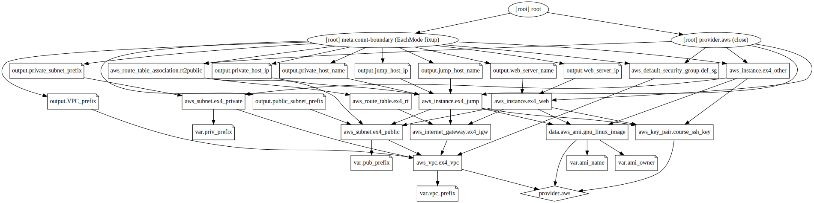
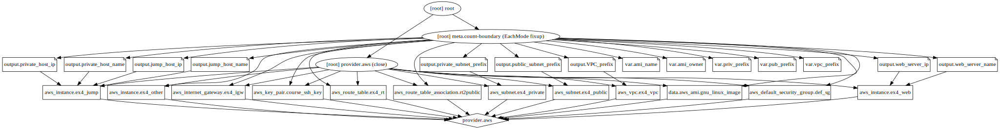

# Exercise 4: Deploy a Virtual Network Infrastructure

The fourth exercise is about deploying more than just one VM.
This builds on the previous exercise
by comprising a web server and SSH access to VMs.
It no longer requires use of S3 (or similar).
A new private subnet, an SSH jump host, and a third VM are added.

## Overview

The hands-on exercise has specific requirements when using AWS (or Azure).
As before, I'll be using
[AWS](https://aws.amazon.com/)
as cloud provider
and
[Terraform](https://www.terraform.io/)
as *Infrastructure-as-Code* tool.

The exercise objectives for AWS are:

1. Create a *VPN* and two *subnets* (public and private).
2. Create an *Internet Gateway* and associate it with the VPC.
3. Create a *route table* for the public subnet and add a *default route*
   pointing to the Internet Gateway.
4. Adjust the *default security group* to allow HTTP, HTTPS, and SSH
   to all virtual machines.  Use GUI if necessary.
5. (Optional) Create an *elastic IP address* and
   an *elastic network interface*.
6. Deploy a *web server* in the public subnet (use the tools you created
   in the [previous exercise](../ex3-web/) to deploy it).
7. Deploy an *SSH jump host* in the public subnet.
8. Deploy *another VM instance* in the private subnet.
9. Verify that:
   1. You can open an SSH session to the web server and jump host
      from the Internet;
   2. You can download a web page from the web server;
   3. The jump host can open an SSH session to the VM instance in the
      private subnet;
   4. The VM instance in the private subnet cannot reach destinations
      outside of your virtual network.
10. (Optional) Write an automated test suite (for example, an
   [Ansible](https://www.ansible.com/) playbook).

## Exploring the Problem Space

I have created a VPC in the
[second exercise](../ex2-iac/),
but no subnets,
no Internet Gateways,
no route tables,
and no routes.

Instead of changing the default Security Group,
I have created a new one in the [third exercise](../ex3-web/),
and have then allowed SSH, HTTP, and HTTPS there.
I did look into using the default Security Group,
but decided against doing so,
because *destroying* the Terraform deployment would not have cleaned up
the changes to the default Security Group.
This is different here,
because the default Security Group of a *new* VPC is configured.
Removing the VPC should remove its default Security Group, too.

I have not yet created an
[elastic IP address](https://docs.aws.amazon.com/AWSEC2/latest/UserGuide/elastic-ip-addresses-eip.html)
(EIP) nor an
[elastic network interface](https://docs.aws.amazon.com/AWSEC2/latest/UserGuide/using-eni.html)
(ENI).

In the [third exercise](../ex3-web/),
I have created a web server,
i.e., Apache running on Ubuntu,
provisioned with cloud-init.

Omitting the web server of the web server setup results in an SSH jump host,
or *another* VM instance. ;-)

For most of this exercise I can build upon previous work.
The simple VPC configuration from exercise 2 needs to be extended
with additional components.
The default Security Group shall be used.
I can use Ubuntu GNU/Linux VM instances as before.
The cloud-init configuration needs to be adjusted slightly,
i.e., no S3 hosted image on the web server index page,
and the *other* VM instance in the private subnet cannot install
updated Ubuntu packages.
Thus I will just look at the new components
before writing a Terraform configuration.

### Internet Gateway

An
[AWS VPC Internet Gateway](https://docs.aws.amazon.com/vpc/latest/userguide/VPC_Internet_Gateway.html)
adds Internet connectivity to a VPC.
As we have seen [before](../ex3-web/),
the default VPC has Internet access,
thus it should have an Internet Gateway.
This can be confirmed using the AWS CLI:

    $ aws ec2 describe-internet-gateways
    -----------------------------------
    |    DescribeInternetGateways     |
    +---------------------------------+
    ||       InternetGateways        ||
    |+-------------------------------+|
    ||       InternetGatewayId       ||
    |+-------------------------------+|
    ||  igw-5b1fdd30                 ||
    |+-------------------------------+|
    |||         Attachments         |||
    ||+------------+----------------+||
    |||    State   |     VpcId      |||
    ||+------------+----------------+||
    |||  available |  vpc-7f13dc15  |||
    ||+------------+----------------+||
    $ aws ec2 describe-vpcs --vpc-ids vpc-7f13dc15
    --------------------------------------------------
    |                  DescribeVpcs                  |
    +------------------------------------------------+
    ||                     Vpcs                     ||
    |+-----------------------+----------------------+|
    ||  CidrBlock            |  172.31.0.0/16       ||
    ||  DhcpOptionsId        |  dopt-983cf3f2       ||
    ||  InstanceTenancy      |  default             ||
    ||  IsDefault            |  True                ||
    ||  State                |  available           ||
    ||  VpcId                |  vpc-7f13dc15        ||
    |+-----------------------+----------------------+|
    |||           CidrBlockAssociationSet          |||
    ||+----------------+---------------------------+||
    |||  AssociationId |  vpc-cidr-assoc-f576a99e  |||
    |||  CidrBlock     |  172.31.0.0/16            |||
    ||+----------------+---------------------------+||
    ||||              CidrBlockState              ||||
    |||+---------------+--------------------------+|||
    ||||  State        |  associated              ||||
    |||+---------------+--------------------------+|||

### Subnets and Route Tables

VM instances are connected to
[subnets](https://docs.aws.amazon.com/vpc/latest/userguide/VPC_Subnets.html)
inside a VPC.
[Route Tables](https://docs.aws.amazon.com/vpc/latest/userguide/VPC_Route_Tables.html)
determine packet forwarding to destinations outside the subnet.

The default VPC comprises subnets and route tables as well:

    $ aws ec2 describe-subnets
    ------------------------------------------------------
    |                   DescribeSubnets                  |
    +----------------------------------------------------+
    ||                      Subnets                     ||
    |+------------------------------+-------------------+|
    ||  AssignIpv6AddressOnCreation |  False            ||
    ||  AvailabilityZone            |  eu-central-1b    ||
    ||  AvailableIpAddressCount     |  4091             ||
    ||  CidrBlock                   |  172.31.32.0/20   ||
    ||  DefaultForAz                |  True             ||
    ||  MapPublicIpOnLaunch         |  True             ||
    ||  State                       |  available        ||
    ||  SubnetId                    |  subnet-e7d63b9b  ||
    ||  VpcId                       |  vpc-7f13dc15     ||
    |+------------------------------+-------------------+|
    ||                      Subnets                     ||
    |+------------------------------+-------------------+|
    ||  AssignIpv6AddressOnCreation |  False            ||
    ||  AvailabilityZone            |  eu-central-1c    ||
    ||  AvailableIpAddressCount     |  4091             ||
    ||  CidrBlock                   |  172.31.0.0/20    ||
    ||  DefaultForAz                |  True             ||
    ||  MapPublicIpOnLaunch         |  True             ||
    ||  State                       |  available        ||
    ||  SubnetId                    |  subnet-852cdcc9  ||
    ||  VpcId                       |  vpc-7f13dc15     ||
    |+------------------------------+-------------------+|
    ||                      Subnets                     ||
    |+------------------------------+-------------------+|
    ||  AssignIpv6AddressOnCreation |  False            ||
    ||  AvailabilityZone            |  eu-central-1a    ||
    ||  AvailableIpAddressCount     |  4091             ||
    ||  CidrBlock                   |  172.31.16.0/20   ||
    ||  DefaultForAz                |  True             ||
    ||  MapPublicIpOnLaunch         |  True             ||
    ||  State                       |  available        ||
    ||  SubnetId                    |  subnet-0207b068  ||
    ||  VpcId                       |  vpc-7f13dc15     ||
    |+------------------------------+-------------------+|
    $ aws ec2 describe-route-tables
    ----------------------------------------------------------------------------
    |                            DescribeRouteTables                           |
    +--------------------------------------------------------------------------+
    ||                               RouteTables                              ||
    |+-----------------------------------+------------------------------------+|
    ||           RouteTableId            |               VpcId                ||
    |+-----------------------------------+------------------------------------+|
    ||  rtb-4c105026                     |  vpc-7f13dc15                      ||
    |+-----------------------------------+------------------------------------+|
    |||                             Associations                             |||
    ||+---------+-------------------------------------+----------------------+||
    |||  Main   |       RouteTableAssociationId       |    RouteTableId      |||
    ||+---------+-------------------------------------+----------------------+||
    |||  True   |  rtbassoc-62f0a00f                  |  rtb-4c105026        |||
    ||+---------+-------------------------------------+----------------------+||
    |||                                Routes                                |||
    ||+-----------------------+---------------+--------------------+---------+||
    ||| DestinationCidrBlock  |   GatewayId   |      Origin        |  State  |||
    ||+-----------------------+---------------+--------------------+---------+||
    |||  172.31.0.0/16        |  local        |  CreateRouteTable  |  active |||
    |||  0.0.0.0/0            |  igw-5b1fdd30 |  CreateRoute       |  active |||
    ||+-----------------------+---------------+--------------------+---------+||

The default (*Main*) route table contains a default route
to the default Internet Gateway.
This is consistent with the observation of successful Internet connectivity
in the previous exercise. ;-)

A *private* subnet is a subnet without route to the Internet.
Since a subnet without specific route table uses the VPC's Main route table,
a route table without (default) route to the Internet needs to be created
and associated with the private subnet,
unless the VPC does not have a Main route table,
or the Main route table does not point to an Internet Gateway.

The subnet model behind this exercise seems to be based
on a VPC without Internet access in the Main route table.
Thus any subnet of this VPC is private by default
and needs to be explicitly configured for Internet access.
This seems to be more secure than requiring to add configuration
to inhibit Internet access.

Many route tables can be created and attached to different objects inside a VPC,
thus allowing for some kind of *Policy Based Routing*.
The use of a special route table for Internet access
is an instance of the Policy Based Routing idea.

### Elastic IP Address

An
[Elastic IP Address](https://docs.aws.amazon.com/AWSEC2/latest/UserGuide/elastic-ip-addresses-eip.html)
(EIP) represents one IPv4 address
that can be associated with an EC2 instance.
By default,
each AWS account is limited to 5 EIPs.
As long as an EIP is associated with a running EC2 instance,
it does not incur extra costs.
EIPs not associated to any instance,
or to an inactive instance,
do incur extra costs.

There are no EIPs allocated to an AWS account by default:

    $ aws ec2 describe-addresses
    -------------------
    |DescribeAddresses|
    +-----------------+

### Elastic Network Interface

An
[Elastic Network Interface](https://docs.aws.amazon.com/AWSEC2/latest/UserGuide/using-eni.html)
(ENI) shows some similarity to an EIP,
because it allows an IP address to move from one instance to another.
But it does not give you a more or less *global* IPv4 address,
but rather IPv4 and / or IPv6 addresses inside a VPC.

There are no ENIs available by default without an EC2 instance:

    $ aws ec2 describe-network-interfaces
    ---------------------------
    |DescribeNetworkInterfaces|
    +-------------------------+

## Terraform

I write a straight-forward
[Terraform configuration file](terraform/vni.tf)
for this exercise.
It is based on the previous solutions
for hands-on exercises two and three.

All variables have default values,
thus I do not need to specify any variables
to `apply` the configuration.

The new resources needed for this exercise
are all quite simple to understand
(for some one with networking background).
Thus I just open the
[Terraform documentation](https://www.terraform.io/docs/configuration/index.html),
select the
[AWS provider](https://www.terraform.io/docs/providers/aws/index.html)
section,
and select the respective resource documentation by name.
The only surprise for me was the need for an additional
[aws\_route\_table\_association](https://www.terraform.io/docs/providers/aws/r/route_table_association.html)
resource to bind the route table to the public subnet.

The EC2 instances require a few adjustments:
specifying the correct subnet via `subnet_id`,
no S3 dependencies,
no specific Security Group,
public IP address assignment according to selected subnet,
and instance specific cloud-config file as `user-data`.

The Terraform
[AWS IGW](https://www.terraform.io/docs/providers/aws/r/internet_gateway.html)
documentation suggests to add an explicit dependency on the IGW
to EC2 instances and Elastic IP addresses.
This seems reasonable,
because without the Internet gateway
the new instance cannot, e.g., install package updates.
Thus I add this dependency to both web server and jump host,
but not the isolated additional VM.

For the moment,
I omit the optional EIP and ENI parts of the exercise.

After using `terraform fmt` to format the Terraform configuration file,
I initialize the Terraform working directory with `terraform init`:

```
$ terraform fmt
vni.tf
$ terraform init

Initializing the backend...

Initializing provider plugins...

Terraform has been successfully initialized!

You may now begin working with Terraform. Try running "terraform plan" to see
any changes that are required for your infrastructure. All Terraform commands
should now work.

If you ever set or change modules or backend configuration for Terraform,
rerun this command to reinitialize your working directory. If you forget, other
commands will detect it and remind you to do so if necessary.
```

Before trying to apply the configuration,
I validate it using `terraform validate`:

```
$ terraform validate
Success! The configuration is valid.

```

Since the configuration successfully validates,
I can use `terraform apply`.
This will present me with the planned changes
and require confirmation before implementing them.

But first I want to try out `terraform graph`.
This can be used to generate different graphs
for different operations.

First I want to see the graph for the *plan*.
This is the default graph generated for a directory
containing a Terraform configuration:

    terraform graph | dot -Tsvg > the_plan.svg

This results in the following image:



Next I want take a look at the *apply* graph:

    terraform graph -type apply | dot -Tsvg > apply.svg

The image looks as follows:



Then I go ahead and use `terraform apply`:

```
$ terraform apply
data.aws_ami.gnu_linux_image: Refreshing state...

An execution plan has been generated and is shown below.
Resource actions are indicated with the following symbols:
  + create

Terraform will perform the following actions:

  # aws_default_security_group.def_sg will be created
  + resource "aws_default_security_group" "def_sg" {
      + arn                    = (known after apply)
      + description            = (known after apply)
      + egress                 = [
          + {
              + cidr_blocks      = [
                  + "0.0.0.0/0",
                ]
              + description      = "Allow Internet access for, e.g., updates"
              + from_port        = 0
              + ipv6_cidr_blocks = []
              + prefix_list_ids  = []
              + protocol         = "-1"
              + security_groups  = []
              + self             = false
              + to_port          = 0
            },
        ]
      + id                     = (known after apply)
      + ingress                = [
          + {
              + cidr_blocks      = [
                  + "0.0.0.0/0",
                ]
              + description      = "Allow HTTP from the Internet"
              + from_port        = 80
              + ipv6_cidr_blocks = []
              + prefix_list_ids  = []
              + protocol         = "tcp"
              + security_groups  = []
              + self             = false
              + to_port          = 80
            },
          + {
              + cidr_blocks      = [
                  + "0.0.0.0/0",
                ]
              + description      = "Allow HTTPS from the Internet"
              + from_port        = 443
              + ipv6_cidr_blocks = []
              + prefix_list_ids  = []
              + protocol         = "tcp"
              + security_groups  = []
              + self             = false
              + to_port          = 443
            },
          + {
              + cidr_blocks      = [
                  + "0.0.0.0/0",
                ]
              + description      = "Allow SSH from the Internet"
              + from_port        = 22
              + ipv6_cidr_blocks = []
              + prefix_list_ids  = []
              + protocol         = "tcp"
              + security_groups  = []
              + self             = false
              + to_port          = 22
            },
          + {
              + cidr_blocks      = []
              + description      = "Allow everything inside the SG"
              + from_port        = 0
              + ipv6_cidr_blocks = []
              + prefix_list_ids  = []
              + protocol         = "-1"
              + security_groups  = []
              + self             = true
              + to_port          = 0
            },
        ]
      + name                   = (known after apply)
      + owner_id               = (known after apply)
      + revoke_rules_on_delete = false
      + tags                   = {
          + "Name" = "Ex. 4 default Security Group"
        }
      + vpc_id                 = (known after apply)
    }

  # aws_instance.ex4_jump will be created
  + resource "aws_instance" "ex4_jump" {
      + ami                          = "ami-0e342d72b12109f91"
      + arn                          = (known after apply)
      + associate_public_ip_address  = (known after apply)
      + availability_zone            = (known after apply)
      + cpu_core_count               = (known after apply)
      + cpu_threads_per_core         = (known after apply)
      + get_password_data            = false
      + host_id                      = (known after apply)
      + id                           = (known after apply)
      + instance_state               = (known after apply)
      + instance_type                = "t2.micro"
      + ipv6_address_count           = (known after apply)
      + ipv6_addresses               = (known after apply)
      + key_name                     = (known after apply)
      + network_interface_id         = (known after apply)
      + password_data                = (known after apply)
      + placement_group              = (known after apply)
      + primary_network_interface_id = (known after apply)
      + private_dns                  = (known after apply)
      + private_ip                   = (known after apply)
      + public_dns                   = (known after apply)
      + public_ip                    = (known after apply)
      + security_groups              = (known after apply)
      + source_dest_check            = true
      + subnet_id                    = (known after apply)
      + tags                         = {
          + "Name" = "Ex. 4 jump host"
        }
      + tenancy                      = (known after apply)
      + user_data                    = "9ed191a9e90b29779765efa9828c23574c1d97a7"
      + volume_tags                  = (known after apply)
      + vpc_security_group_ids       = (known after apply)

      + ebs_block_device {
          + delete_on_termination = (known after apply)
          + device_name           = (known after apply)
          + encrypted             = (known after apply)
          + iops                  = (known after apply)
          + kms_key_id            = (known after apply)
          + snapshot_id           = (known after apply)
          + volume_id             = (known after apply)
          + volume_size           = (known after apply)
          + volume_type           = (known after apply)
        }

      + ephemeral_block_device {
          + device_name  = (known after apply)
          + no_device    = (known after apply)
          + virtual_name = (known after apply)
        }

      + network_interface {
          + delete_on_termination = (known after apply)
          + device_index          = (known after apply)
          + network_interface_id  = (known after apply)
        }

      + root_block_device {
          + delete_on_termination = (known after apply)
          + encrypted             = (known after apply)
          + iops                  = (known after apply)
          + kms_key_id            = (known after apply)
          + volume_id             = (known after apply)
          + volume_size           = (known after apply)
          + volume_type           = (known after apply)
        }
    }

  # aws_instance.ex4_other will be created
  + resource "aws_instance" "ex4_other" {
      + ami                          = "ami-0e342d72b12109f91"
      + arn                          = (known after apply)
      + associate_public_ip_address  = (known after apply)
      + availability_zone            = (known after apply)
      + cpu_core_count               = (known after apply)
      + cpu_threads_per_core         = (known after apply)
      + get_password_data            = false
      + host_id                      = (known after apply)
      + id                           = (known after apply)
      + instance_state               = (known after apply)
      + instance_type                = "t2.micro"
      + ipv6_address_count           = (known after apply)
      + ipv6_addresses               = (known after apply)
      + key_name                     = (known after apply)
      + network_interface_id         = (known after apply)
      + password_data                = (known after apply)
      + placement_group              = (known after apply)
      + primary_network_interface_id = (known after apply)
      + private_dns                  = (known after apply)
      + private_ip                   = (known after apply)
      + public_dns                   = (known after apply)
      + public_ip                    = (known after apply)
      + security_groups              = (known after apply)
      + source_dest_check            = true
      + subnet_id                    = (known after apply)
      + tags                         = {
          + "Name" = "Ex. 4 private host"
        }
      + tenancy                      = (known after apply)
      + user_data                    = "455b01c87a20b41630a012c794e4d53d8cda1d75"
      + volume_tags                  = (known after apply)
      + vpc_security_group_ids       = (known after apply)

      + ebs_block_device {
          + delete_on_termination = (known after apply)
          + device_name           = (known after apply)
          + encrypted             = (known after apply)
          + iops                  = (known after apply)
          + kms_key_id            = (known after apply)
          + snapshot_id           = (known after apply)
          + volume_id             = (known after apply)
          + volume_size           = (known after apply)
          + volume_type           = (known after apply)
        }

      + ephemeral_block_device {
          + device_name  = (known after apply)
          + no_device    = (known after apply)
          + virtual_name = (known after apply)
        }

      + network_interface {
          + delete_on_termination = (known after apply)
          + device_index          = (known after apply)
          + network_interface_id  = (known after apply)
        }

      + root_block_device {
          + delete_on_termination = (known after apply)
          + encrypted             = (known after apply)
          + iops                  = (known after apply)
          + kms_key_id            = (known after apply)
          + volume_id             = (known after apply)
          + volume_size           = (known after apply)
          + volume_type           = (known after apply)
        }
    }

  # aws_instance.ex4_web will be created
  + resource "aws_instance" "ex4_web" {
      + ami                          = "ami-0e342d72b12109f91"
      + arn                          = (known after apply)
      + associate_public_ip_address  = (known after apply)
      + availability_zone            = (known after apply)
      + cpu_core_count               = (known after apply)
      + cpu_threads_per_core         = (known after apply)
      + get_password_data            = false
      + host_id                      = (known after apply)
      + id                           = (known after apply)
      + instance_state               = (known after apply)
      + instance_type                = "t2.micro"
      + ipv6_address_count           = (known after apply)
      + ipv6_addresses               = (known after apply)
      + key_name                     = (known after apply)
      + network_interface_id         = (known after apply)
      + password_data                = (known after apply)
      + placement_group              = (known after apply)
      + primary_network_interface_id = (known after apply)
      + private_dns                  = (known after apply)
      + private_ip                   = (known after apply)
      + public_dns                   = (known after apply)
      + public_ip                    = (known after apply)
      + security_groups              = (known after apply)
      + source_dest_check            = true
      + subnet_id                    = (known after apply)
      + tags                         = {
          + "Name" = "Ex. 4 web server"
        }
      + tenancy                      = (known after apply)
      + user_data                    = "6197aaec194f10c08caf60960ec297a41f695ad2"
      + volume_tags                  = (known after apply)
      + vpc_security_group_ids       = (known after apply)

      + ebs_block_device {
          + delete_on_termination = (known after apply)
          + device_name           = (known after apply)
          + encrypted             = (known after apply)
          + iops                  = (known after apply)
          + kms_key_id            = (known after apply)
          + snapshot_id           = (known after apply)
          + volume_id             = (known after apply)
          + volume_size           = (known after apply)
          + volume_type           = (known after apply)
        }

      + ephemeral_block_device {
          + device_name  = (known after apply)
          + no_device    = (known after apply)
          + virtual_name = (known after apply)
        }

      + network_interface {
          + delete_on_termination = (known after apply)
          + device_index          = (known after apply)
          + network_interface_id  = (known after apply)
        }

      + root_block_device {
          + delete_on_termination = (known after apply)
          + encrypted             = (known after apply)
          + iops                  = (known after apply)
          + kms_key_id            = (known after apply)
          + volume_id             = (known after apply)
          + volume_size           = (known after apply)
          + volume_type           = (known after apply)
        }
    }

  # aws_internet_gateway.ex4_igw will be created
  + resource "aws_internet_gateway" "ex4_igw" {
      + id       = (known after apply)
      + owner_id = (known after apply)
      + tags     = {
          + "Name" = "Ex. 4 Internet gateway"
        }
      + vpc_id   = (known after apply)
    }

  # aws_key_pair.course_ssh_key will be created
  + resource "aws_key_pair" "course_ssh_key" {
      + fingerprint = (known after apply)
      + id          = (known after apply)
      + key_name    = "tf-pubcloud2020"
      + key_pair_id = (known after apply)
      + public_key  = "ssh-rsa AAAAB3NzaC1yc2EAAAADAQABAAACAQDDiXuVGxn6zqLCPKbcojNC813FAnOPBWToBz/XTQaMzMsoAeKMRwVrUoyHEVj8UTFiuEUbTz/0jHItv5ZmFXI1DNY1m+hXxCDVcBp8ojCutX3+AJ012qG2PIZaloaYCjrTkhHj9VmMHAl1jzJ0EbPsoU/Qc4pZCNUNaCVCkG6EHisOUy9wx20i4gA/nrDnjIxk9TD2mGdlVCK7SESH/vGWgMtU6fLI65trtC4eojPNNUyMq8tTLyJxoTdYEwMY5alKkcjjw6+yVBOrtYgZSlMW02WLTkJT7eCxwVHig8a+bywiwAxuvYlUgfmOHEGEIXXTGk/+KNiLrDXdmkK4kuUvlf6rD7qR/kedqQAt0k5v/PiW3ufpej7n1ZBZroSsBT/0Yp5UcCLxpzskUYu+TRLRp+6gI50KsNe/oT8tesNtOVTK2ePD4eXApXAYwQpXy1389c4gGgh4wWljmHyeoFjcd4Soq847/PNspRdswR/u5jyswTsCROKsCJ4+whJRme8JoqaZHGBTpTu9n6gaZJVXbFM/55RYh0bpuCD5BHrdk0+HX4BmhJ1KqdDTDR84y2riwlpv6Eiw8AX8N2GVLOpP6RMt/AUCNUEy5nPWJosKb+UQE/j1dRJ9iorm2EGbh30dv/nRCb2Cu7BVyNWbmSrVaKdJub28SfV5L51sd+ATBw== auerswald@short"
    }

  # aws_route_table.ex4_rt will be created
  + resource "aws_route_table" "ex4_rt" {
      + id               = (known after apply)
      + owner_id         = (known after apply)
      + propagating_vgws = (known after apply)
      + route            = [
          + {
              + cidr_block                = "0.0.0.0/0"
              + egress_only_gateway_id    = ""
              + gateway_id                = (known after apply)
              + instance_id               = ""
              + ipv6_cidr_block           = ""
              + nat_gateway_id            = ""
              + network_interface_id      = ""
              + transit_gateway_id        = ""
              + vpc_peering_connection_id = ""
            },
        ]
      + tags             = {
          + "Name" = "Ex. 4 route table for Internet access"
        }
      + vpc_id           = (known after apply)
    }

  # aws_route_table_association.rt2public will be created
  + resource "aws_route_table_association" "rt2public" {
      + id             = (known after apply)
      + route_table_id = (known after apply)
      + subnet_id      = (known after apply)
    }

  # aws_subnet.ex4_private will be created
  + resource "aws_subnet" "ex4_private" {
      + arn                             = (known after apply)
      + assign_ipv6_address_on_creation = false
      + availability_zone               = (known after apply)
      + availability_zone_id            = (known after apply)
      + cidr_block                      = "10.42.0.0/24"
      + id                              = (known after apply)
      + ipv6_cidr_block                 = (known after apply)
      + ipv6_cidr_block_association_id  = (known after apply)
      + map_public_ip_on_launch         = false
      + owner_id                        = (known after apply)
      + tags                            = {
          + "Name" = "Ex. 4 private subnet"
        }
      + vpc_id                          = (known after apply)
    }

  # aws_subnet.ex4_public will be created
  + resource "aws_subnet" "ex4_public" {
      + arn                             = (known after apply)
      + assign_ipv6_address_on_creation = false
      + availability_zone               = (known after apply)
      + availability_zone_id            = (known after apply)
      + cidr_block                      = "10.42.255.0/24"
      + id                              = (known after apply)
      + ipv6_cidr_block                 = (known after apply)
      + ipv6_cidr_block_association_id  = (known after apply)
      + map_public_ip_on_launch         = true
      + owner_id                        = (known after apply)
      + tags                            = {
          + "Name" = "Ex. 4 public subnet"
        }
      + vpc_id                          = (known after apply)
    }

  # aws_vpc.ex4_vpc will be created
  + resource "aws_vpc" "ex4_vpc" {
      + arn                              = (known after apply)
      + assign_generated_ipv6_cidr_block = false
      + cidr_block                       = "10.42.0.0/16"
      + default_network_acl_id           = (known after apply)
      + default_route_table_id           = (known after apply)
      + default_security_group_id        = (known after apply)
      + dhcp_options_id                  = (known after apply)
      + enable_classiclink               = (known after apply)
      + enable_classiclink_dns_support   = (known after apply)
      + enable_dns_hostnames             = true
      + enable_dns_support               = true
      + id                               = (known after apply)
      + instance_tenancy                 = "default"
      + ipv6_association_id              = (known after apply)
      + ipv6_cidr_block                  = (known after apply)
      + main_route_table_id              = (known after apply)
      + owner_id                         = (known after apply)
      + tags                             = {
          + "Name" = "Ex. 4 VPC"
        }
    }

Plan: 11 to add, 0 to change, 0 to destroy.

Do you want to perform these actions?
  Terraform will perform the actions described above.
  Only 'yes' will be accepted to approve.

  Enter a value: yes

aws_key_pair.course_ssh_key: Creating...
aws_vpc.ex4_vpc: Creating...
aws_key_pair.course_ssh_key: Creation complete after 1s [id=tf-pubcloud2020]
aws_vpc.ex4_vpc: Creation complete after 7s [id=vpc-0b508a704edb473cb]
aws_internet_gateway.ex4_igw: Creating...
aws_subnet.ex4_private: Creating...
aws_subnet.ex4_public: Creating...
aws_default_security_group.def_sg: Creating...
aws_subnet.ex4_private: Creation complete after 3s [id=subnet-02521eb45700f5398]
aws_instance.ex4_other: Creating...
aws_subnet.ex4_public: Creation complete after 3s [id=subnet-07a2d8e446b100c58]
aws_internet_gateway.ex4_igw: Creation complete after 4s [id=igw-0f441755d966d38af]
aws_route_table.ex4_rt: Creating...
aws_instance.ex4_web: Creating...
aws_instance.ex4_jump: Creating...
aws_default_security_group.def_sg: Creation complete after 5s [id=sg-084a86c98ad8c2128]
aws_route_table.ex4_rt: Creation complete after 2s [id=rtb-0667e7f44e185c197]
aws_route_table_association.rt2public: Creating...
aws_route_table_association.rt2public: Creation complete after 0s [id=rtbassoc-03399492da585a8f6]
aws_instance.ex4_other: Still creating... [10s elapsed]
aws_instance.ex4_web: Still creating... [10s elapsed]
aws_instance.ex4_jump: Still creating... [10s elapsed]
aws_instance.ex4_other: Still creating... [20s elapsed]
aws_instance.ex4_web: Still creating... [20s elapsed]
aws_instance.ex4_jump: Still creating... [20s elapsed]
aws_instance.ex4_other: Still creating... [30s elapsed]
aws_instance.ex4_web: Still creating... [30s elapsed]
aws_instance.ex4_jump: Still creating... [30s elapsed]
aws_instance.ex4_other: Creation complete after 33s [id=i-027f0cb1638fd711c]
aws_instance.ex4_jump: Creation complete after 32s [id=i-0e2bdac3c56bd21e5]
aws_instance.ex4_web: Still creating... [40s elapsed]
aws_instance.ex4_web: Creation complete after 48s [id=i-023b492515018c825]

Apply complete! Resources: 11 added, 0 changed, 0 destroyed.

Outputs:

VPC_prefix = 10.42.0.0/16
jump_host_ip = 18.185.67.143
jump_host_name = ec2-18-185-67-143.eu-central-1.compute.amazonaws.com
private_host_ip = 10.42.255.147
private_host_name = ip-10-42-255-147.eu-central-1.compute.internal
private_subnet_prefix = 10.42.0.0/24
public_subnet_prefix = 10.42.255.0/24
web_server_ip = 54.93.244.69
web_server_name = ec2-54-93-244-69.eu-central-1.compute.amazonaws.com
```

That looks promising.
Let's find out what happened. ;-)

(*Spoiler:
I messed up the output definitions for the other VM in the private subnet.*)

Terraform can `show` the deployment:

```
$ terraform show
# aws_default_security_group.def_sg:
resource "aws_default_security_group" "def_sg" {
    arn                    = "arn:aws:ec2:eu-central-1:143440624024:security-group/sg-084a86c98ad8c2128"
    description            = "default VPC security group"
    egress                 = [
        {
            cidr_blocks      = [
                "0.0.0.0/0",
            ]
            description      = "Allow Internet access for, e.g., updates"
            from_port        = 0
            ipv6_cidr_blocks = []
            prefix_list_ids  = []
            protocol         = "-1"
            security_groups  = []
            self             = false
            to_port          = 0
        },
    ]
    id                     = "sg-084a86c98ad8c2128"
    ingress                = [
        {
            cidr_blocks      = [
                "0.0.0.0/0",
            ]
            description      = "Allow HTTP from the Internet"
            from_port        = 80
            ipv6_cidr_blocks = []
            prefix_list_ids  = []
            protocol         = "tcp"
            security_groups  = []
            self             = false
            to_port          = 80
        },
        {
            cidr_blocks      = [
                "0.0.0.0/0",
            ]
            description      = "Allow HTTPS from the Internet"
            from_port        = 443
            ipv6_cidr_blocks = []
            prefix_list_ids  = []
            protocol         = "tcp"
            security_groups  = []
            self             = false
            to_port          = 443
        },
        {
            cidr_blocks      = [
                "0.0.0.0/0",
            ]
            description      = "Allow SSH from the Internet"
            from_port        = 22
            ipv6_cidr_blocks = []
            prefix_list_ids  = []
            protocol         = "tcp"
            security_groups  = []
            self             = false
            to_port          = 22
        },
        {
            cidr_blocks      = []
            description      = "Allow everything inside the SG"
            from_port        = 0
            ipv6_cidr_blocks = []
            prefix_list_ids  = []
            protocol         = "-1"
            security_groups  = []
            self             = true
            to_port          = 0
        },
    ]
    name                   = "default"
    owner_id               = "143440624024"
    revoke_rules_on_delete = false
    tags                   = {
        "Name" = "Ex. 4 default Security Group"
    }
    vpc_id                 = "vpc-0b508a704edb473cb"
}

# aws_instance.ex4_jump:
resource "aws_instance" "ex4_jump" {
    ami                          = "ami-0e342d72b12109f91"
    arn                          = "arn:aws:ec2:eu-central-1:143440624024:instance/i-0e2bdac3c56bd21e5"
    associate_public_ip_address  = true
    availability_zone            = "eu-central-1a"
    cpu_core_count               = 1
    cpu_threads_per_core         = 1
    disable_api_termination      = false
    ebs_optimized                = false
    get_password_data            = false
    hibernation                  = false
    id                           = "i-0e2bdac3c56bd21e5"
    instance_state               = "running"
    instance_type                = "t2.micro"
    ipv6_address_count           = 0
    ipv6_addresses               = []
    key_name                     = "tf-pubcloud2020"
    monitoring                   = false
    primary_network_interface_id = "eni-042766ede1486ffdb"
    private_dns                  = "ip-10-42-255-147.eu-central-1.compute.internal"
    private_ip                   = "10.42.255.147"
    public_dns                   = "ec2-18-185-67-143.eu-central-1.compute.amazonaws.com"
    public_ip                    = "18.185.67.143"
    security_groups              = []
    source_dest_check            = true
    subnet_id                    = "subnet-07a2d8e446b100c58"
    tags                         = {
        "Name" = "Ex. 4 jump host"
    }
    tenancy                      = "default"
    user_data                    = "9ed191a9e90b29779765efa9828c23574c1d97a7"
    volume_tags                  = {}
    vpc_security_group_ids       = [
        "sg-084a86c98ad8c2128",
    ]

    credit_specification {
        cpu_credits = "standard"
    }

    root_block_device {
        delete_on_termination = true
        encrypted             = false
        iops                  = 100
        volume_id             = "vol-07f92581bbad1b864"
        volume_size           = 8
        volume_type           = "gp2"
    }
}

# aws_instance.ex4_other:
resource "aws_instance" "ex4_other" {
    ami                          = "ami-0e342d72b12109f91"
    arn                          = "arn:aws:ec2:eu-central-1:143440624024:instance/i-027f0cb1638fd711c"
    associate_public_ip_address  = false
    availability_zone            = "eu-central-1c"
    cpu_core_count               = 1
    cpu_threads_per_core         = 1
    disable_api_termination      = false
    ebs_optimized                = false
    get_password_data            = false
    hibernation                  = false
    id                           = "i-027f0cb1638fd711c"
    instance_state               = "running"
    instance_type                = "t2.micro"
    ipv6_address_count           = 0
    ipv6_addresses               = []
    key_name                     = "tf-pubcloud2020"
    monitoring                   = false
    primary_network_interface_id = "eni-005036578823f5482"
    private_dns                  = "ip-10-42-0-143.eu-central-1.compute.internal"
    private_ip                   = "10.42.0.143"
    security_groups              = []
    source_dest_check            = true
    subnet_id                    = "subnet-02521eb45700f5398"
    tags                         = {
        "Name" = "Ex. 4 private host"
    }
    tenancy                      = "default"
    user_data                    = "455b01c87a20b41630a012c794e4d53d8cda1d75"
    volume_tags                  = {}
    vpc_security_group_ids       = [
        "sg-084a86c98ad8c2128",
    ]

    credit_specification {
        cpu_credits = "standard"
    }

    root_block_device {
        delete_on_termination = true
        encrypted             = false
        iops                  = 100
        volume_id             = "vol-04c5697e3ac46667b"
        volume_size           = 8
        volume_type           = "gp2"
    }
}

# aws_instance.ex4_web:
resource "aws_instance" "ex4_web" {
    ami                          = "ami-0e342d72b12109f91"
    arn                          = "arn:aws:ec2:eu-central-1:143440624024:instance/i-023b492515018c825"
    associate_public_ip_address  = true
    availability_zone            = "eu-central-1a"
    cpu_core_count               = 1
    cpu_threads_per_core         = 1
    disable_api_termination      = false
    ebs_optimized                = false
    get_password_data            = false
    hibernation                  = false
    id                           = "i-023b492515018c825"
    instance_state               = "running"
    instance_type                = "t2.micro"
    ipv6_address_count           = 0
    ipv6_addresses               = []
    key_name                     = "tf-pubcloud2020"
    monitoring                   = false
    primary_network_interface_id = "eni-0b0c13a8df17bd2ad"
    private_dns                  = "ip-10-42-255-153.eu-central-1.compute.internal"
    private_ip                   = "10.42.255.153"
    public_dns                   = "ec2-54-93-244-69.eu-central-1.compute.amazonaws.com"
    public_ip                    = "54.93.244.69"
    security_groups              = []
    source_dest_check            = true
    subnet_id                    = "subnet-07a2d8e446b100c58"
    tags                         = {
        "Name" = "Ex. 4 web server"
    }
    tenancy                      = "default"
    user_data                    = "6197aaec194f10c08caf60960ec297a41f695ad2"
    volume_tags                  = {}
    vpc_security_group_ids       = [
        "sg-084a86c98ad8c2128",
    ]

    credit_specification {
        cpu_credits = "standard"
    }

    root_block_device {
        delete_on_termination = true
        encrypted             = false
        iops                  = 100
        volume_id             = "vol-0bd92088d60c8dceb"
        volume_size           = 8
        volume_type           = "gp2"
    }
}

# aws_internet_gateway.ex4_igw:
resource "aws_internet_gateway" "ex4_igw" {
    id       = "igw-0f441755d966d38af"
    owner_id = "143440624024"
    tags     = {
        "Name" = "Ex. 4 Internet gateway"
    }
    vpc_id   = "vpc-0b508a704edb473cb"
}

# aws_key_pair.course_ssh_key:
resource "aws_key_pair" "course_ssh_key" {
    fingerprint = "bc:c0:ba:de:c1:2d:a8:38:5d:08:33:ba:dd:18:db:c4"
    id          = "tf-pubcloud2020"
    key_name    = "tf-pubcloud2020"
    key_pair_id = "key-04b1f0783a9f3db00"
    public_key  = "ssh-rsa AAAAB3NzaC1yc2EAAAADAQABAAACAQDDiXuVGxn6zqLCPKbcojNC813FAnOPBWToBz/XTQaMzMsoAeKMRwVrUoyHEVj8UTFiuEUbTz/0jHItv5ZmFXI1DNY1m+hXxCDVcBp8ojCutX3+AJ012qG2PIZaloaYCjrTkhHj9VmMHAl1jzJ0EbPsoU/Qc4pZCNUNaCVCkG6EHisOUy9wx20i4gA/nrDnjIxk9TD2mGdlVCK7SESH/vGWgMtU6fLI65trtC4eojPNNUyMq8tTLyJxoTdYEwMY5alKkcjjw6+yVBOrtYgZSlMW02WLTkJT7eCxwVHig8a+bywiwAxuvYlUgfmOHEGEIXXTGk/+KNiLrDXdmkK4kuUvlf6rD7qR/kedqQAt0k5v/PiW3ufpej7n1ZBZroSsBT/0Yp5UcCLxpzskUYu+TRLRp+6gI50KsNe/oT8tesNtOVTK2ePD4eXApXAYwQpXy1389c4gGgh4wWljmHyeoFjcd4Soq847/PNspRdswR/u5jyswTsCROKsCJ4+whJRme8JoqaZHGBTpTu9n6gaZJVXbFM/55RYh0bpuCD5BHrdk0+HX4BmhJ1KqdDTDR84y2riwlpv6Eiw8AX8N2GVLOpP6RMt/AUCNUEy5nPWJosKb+UQE/j1dRJ9iorm2EGbh30dv/nRCb2Cu7BVyNWbmSrVaKdJub28SfV5L51sd+ATBw== auerswald@short"
}

# aws_route_table.ex4_rt:
resource "aws_route_table" "ex4_rt" {
    id               = "rtb-0667e7f44e185c197"
    owner_id         = "143440624024"
    propagating_vgws = []
    route            = [
        {
            cidr_block                = "0.0.0.0/0"
            egress_only_gateway_id    = ""
            gateway_id                = "igw-0f441755d966d38af"
            instance_id               = ""
            ipv6_cidr_block           = ""
            nat_gateway_id            = ""
            network_interface_id      = ""
            transit_gateway_id        = ""
            vpc_peering_connection_id = ""
        },
    ]
    tags             = {
        "Name" = "Ex. 4 route table for Internet access"
    }
    vpc_id           = "vpc-0b508a704edb473cb"
}

# aws_route_table_association.rt2public:
resource "aws_route_table_association" "rt2public" {
    id             = "rtbassoc-03399492da585a8f6"
    route_table_id = "rtb-0667e7f44e185c197"
    subnet_id      = "subnet-07a2d8e446b100c58"
}

# aws_subnet.ex4_private:
resource "aws_subnet" "ex4_private" {
    arn                             = "arn:aws:ec2:eu-central-1:143440624024:subnet/subnet-02521eb45700f5398"
    assign_ipv6_address_on_creation = false
    availability_zone               = "eu-central-1c"
    availability_zone_id            = "euc1-az1"
    cidr_block                      = "10.42.0.0/24"
    id                              = "subnet-02521eb45700f5398"
    map_public_ip_on_launch         = false
    owner_id                        = "143440624024"
    tags                            = {
        "Name" = "Ex. 4 private subnet"
    }
    vpc_id                          = "vpc-0b508a704edb473cb"
}

# aws_subnet.ex4_public:
resource "aws_subnet" "ex4_public" {
    arn                             = "arn:aws:ec2:eu-central-1:143440624024:subnet/subnet-07a2d8e446b100c58"
    assign_ipv6_address_on_creation = false
    availability_zone               = "eu-central-1a"
    availability_zone_id            = "euc1-az2"
    cidr_block                      = "10.42.255.0/24"
    id                              = "subnet-07a2d8e446b100c58"
    map_public_ip_on_launch         = true
    owner_id                        = "143440624024"
    tags                            = {
        "Name" = "Ex. 4 public subnet"
    }
    vpc_id                          = "vpc-0b508a704edb473cb"
}

# aws_vpc.ex4_vpc:
resource "aws_vpc" "ex4_vpc" {
    arn                              = "arn:aws:ec2:eu-central-1:143440624024:vpc/vpc-0b508a704edb473cb"
    assign_generated_ipv6_cidr_block = false
    cidr_block                       = "10.42.0.0/16"
    default_network_acl_id           = "acl-09e1365852f2f4dfd"
    default_route_table_id           = "rtb-0322e2794276fc538"
    default_security_group_id        = "sg-084a86c98ad8c2128"
    dhcp_options_id                  = "dopt-983cf3f2"
    enable_dns_hostnames             = true
    enable_dns_support               = true
    id                               = "vpc-0b508a704edb473cb"
    instance_tenancy                 = "default"
    main_route_table_id              = "rtb-0322e2794276fc538"
    owner_id                         = "143440624024"
    tags                             = {
        "Name" = "Ex. 4 VPC"
    }
}

# data.aws_ami.gnu_linux_image:
data "aws_ami" "gnu_linux_image" {
    architecture          = "x86_64"
    block_device_mappings = [
        {
            device_name  = "/dev/sda1"
            ebs          = {
                "delete_on_termination" = "true"
                "encrypted"             = "false"
                "iops"                  = "0"
                "snapshot_id"           = "snap-04380c2d33633ce33"
                "volume_size"           = "8"
                "volume_type"           = "gp2"
            }
            no_device    = ""
            virtual_name = ""
        },
        {
            device_name  = "/dev/sdb"
            ebs          = {}
            no_device    = ""
            virtual_name = "ephemeral0"
        },
        {
            device_name  = "/dev/sdc"
            ebs          = {}
            no_device    = ""
            virtual_name = "ephemeral1"
        },
    ]
    creation_date         = "2020-04-09T16:44:38.000Z"
    description           = "Canonical, Ubuntu, 18.04 LTS, amd64 bionic image build on 2020-04-08"
    hypervisor            = "xen"
    id                    = "ami-0e342d72b12109f91"
    image_id              = "ami-0e342d72b12109f91"
    image_location        = "099720109477/ubuntu/images/hvm-ssd/ubuntu-bionic-18.04-amd64-server-20200408"
    image_type            = "machine"
    most_recent           = true
    name                  = "ubuntu/images/hvm-ssd/ubuntu-bionic-18.04-amd64-server-20200408"
    owner_id              = "099720109477"
    owners                = [
        "099720109477",
    ]
    product_codes         = []
    public                = true
    root_device_name      = "/dev/sda1"
    root_device_type      = "ebs"
    root_snapshot_id      = "snap-04380c2d33633ce33"
    sriov_net_support     = "simple"
    state                 = "available"
    state_reason          = {
        "code"    = "UNSET"
        "message" = "UNSET"
    }
    tags                  = {}
    virtualization_type   = "hvm"

    filter {
        name   = "name"
        values = [
            "ubuntu/images/hvm-ssd/ubuntu-*-18.04-amd64-server-????????",
        ]
    }
    filter {
        name   = "state"
        values = [
            "available",
        ]
    }
}


Outputs:

VPC_prefix = "10.42.0.0/16"
jump_host_ip = "18.185.67.143"
jump_host_name = "ec2-18-185-67-143.eu-central-1.compute.amazonaws.com"
private_host_ip = "10.42.255.147"
private_host_name = "ip-10-42-255-147.eu-central-1.compute.internal"
private_subnet_prefix = "10.42.0.0/24"
public_subnet_prefix = "10.42.255.0/24"
web_server_ip = "54.93.244.69"
web_server_name = "ec2-54-93-244-69.eu-central-1.compute.amazonaws.com"
```

The AWS CLI should show additional objects as well:

```
$ aws ec2 describe-vpcs --filter Name=isDefault,Values=false
-----------------------------------------------------------
|                      DescribeVpcs                       |
+---------------------------------------------------------+
||                         Vpcs                          ||
|+-----------------------+-------------------------------+|
||  CidrBlock            |  10.42.0.0/16                 ||
||  DhcpOptionsId        |  dopt-983cf3f2                ||
||  InstanceTenancy      |  default                      ||
||  IsDefault            |  False                        ||
||  State                |  available                    ||
||  VpcId                |  vpc-0b508a704edb473cb        ||
|+-----------------------+-------------------------------+|
|||               CidrBlockAssociationSet               |||
||+----------------+------------------------------------+||
|||  AssociationId |  vpc-cidr-assoc-0e2196c2c96d0f3a0  |||
|||  CidrBlock     |  10.42.0.0/16                      |||
||+----------------+------------------------------------+||
||||                  CidrBlockState                   ||||
|||+-------------------+-------------------------------+|||
||||  State            |  associated                   ||||
|||+-------------------+-------------------------------+|||
|||                        Tags                         |||
||+--------------------+--------------------------------+||
|||  Key               |  Name                          |||
|||  Value             |  Ex. 4 VPC                     |||
||+--------------------+--------------------------------+||
$ aws ec2 describe-subnets --filter Name=vpc-id,Values=vpc-0b508a704edb473cb
---------------------------------------------------------------
|                       DescribeSubnets                       |
+-------------------------------------------------------------+
||                          Subnets                          ||
|+------------------------------+----------------------------+|
||  AssignIpv6AddressOnCreation |  False                     ||
||  AvailabilityZone            |  eu-central-1c             ||
||  AvailableIpAddressCount     |  250                       ||
||  CidrBlock                   |  10.42.0.0/24              ||
||  DefaultForAz                |  False                     ||
||  MapPublicIpOnLaunch         |  False                     ||
||  State                       |  available                 ||
||  SubnetId                    |  subnet-02521eb45700f5398  ||
||  VpcId                       |  vpc-0b508a704edb473cb     ||
|+------------------------------+----------------------------+|
|||                          Tags                           |||
||+--------------+------------------------------------------+||
|||  Key         |  Name                                    |||
|||  Value       |  Ex. 4 private subnet                    |||
||+--------------+------------------------------------------+||
||                          Subnets                          ||
|+------------------------------+----------------------------+|
||  AssignIpv6AddressOnCreation |  False                     ||
||  AvailabilityZone            |  eu-central-1a             ||
||  AvailableIpAddressCount     |  249                       ||
||  CidrBlock                   |  10.42.255.0/24            ||
||  DefaultForAz                |  False                     ||
||  MapPublicIpOnLaunch         |  True                      ||
||  State                       |  available                 ||
||  SubnetId                    |  subnet-07a2d8e446b100c58  ||
||  VpcId                       |  vpc-0b508a704edb473cb     ||
|+------------------------------+----------------------------+|
|||                          Tags                           |||
||+---------------+-----------------------------------------+||
|||  Key          |  Name                                   |||
|||  Value        |  Ex. 4 public subnet                    |||
||+---------------+-----------------------------------------+||
$ aws ec2 describe-internet-gateways --filter Name=attachment.vpc-id,Values=vpc-0b508a704edb473cb
--------------------------------------------
|         DescribeInternetGateways         |
+------------------------------------------+
||            InternetGateways            ||
|+----------------------------------------+|
||            InternetGatewayId           ||
|+----------------------------------------+|
||  igw-0f441755d966d38af                 ||
|+----------------------------------------+|
|||              Attachments             |||
||+------------+-------------------------+||
|||    State   |          VpcId          |||
||+------------+-------------------------+||
|||  available |  vpc-0b508a704edb473cb  |||
||+------------+-------------------------+||
|||                 Tags                 |||
||+-------+------------------------------+||
|||  Key  |            Value             |||
||+-------+------------------------------+||
|||  Name |  Ex. 4 Internet gateway      |||
||+-------+------------------------------+||
$ aws ec2 describe-route-tables --filter Name=vpc-id,Values=vpc-0b508a704edb473cb
-------------------------------------------------------------------------------------
|                                DescribeRouteTables                                |
+-----------------------------------------------------------------------------------+
||                                   RouteTables                                   ||
|+------------------------------+--------------------------------------------------+|
||  RouteTableId                |  rtb-0322e2794276fc538                           ||
||  VpcId                       |  vpc-0b508a704edb473cb                           ||
|+------------------------------+--------------------------------------------------+|
|||                                 Associations                                  |||
||+------------------------------------+------------------------------------------+||
|||  Main                              |  True                                    |||
|||  RouteTableAssociationId           |  rtbassoc-0216fffa2d6ff036e              |||
|||  RouteTableId                      |  rtb-0322e2794276fc538                   |||
||+------------------------------------+------------------------------------------+||
|||                                    Routes                                     |||
||+------------------------------------------+------------------------------------+||
|||  DestinationCidrBlock                    |  10.42.0.0/16                      |||
|||  GatewayId                               |  local                             |||
|||  Origin                                  |  CreateRouteTable                  |||
|||  State                                   |  active                            |||
||+------------------------------------------+------------------------------------+||
||                                   RouteTables                                   ||
|+------------------------------+--------------------------------------------------+|
||  RouteTableId                |  rtb-0667e7f44e185c197                           ||
||  VpcId                       |  vpc-0b508a704edb473cb                           ||
|+------------------------------+--------------------------------------------------+|
|||                                 Associations                                  |||
||+------------------------------------+------------------------------------------+||
|||  Main                              |  False                                   |||
|||  RouteTableAssociationId           |  rtbassoc-03399492da585a8f6              |||
|||  RouteTableId                      |  rtb-0667e7f44e185c197                   |||
|||  SubnetId                          |  subnet-07a2d8e446b100c58                |||
||+------------------------------------+------------------------------------------+||
|||                                    Routes                                     |||
||+----------------------+-------------------------+--------------------+---------+||
||| DestinationCidrBlock |        GatewayId        |      Origin        |  State  |||
||+----------------------+-------------------------+--------------------+---------+||
|||  10.42.0.0/16        |  local                  |  CreateRouteTable  |  active |||
|||  0.0.0.0/0           |  igw-0f441755d966d38af  |  CreateRoute       |  active |||
||+----------------------+-------------------------+--------------------+---------+||
|||                                     Tags                                      |||
||+-------------+-----------------------------------------------------------------+||
|||  Key        |  Name                                                           |||
|||  Value      |  Ex. 4 route table for Internet access                          |||
||+-------------+-----------------------------------------------------------------+||
$ aws ec2 describe-instances
---------------------------------------------------------------------------------------
|                                  DescribeInstances                                  |
+-------------------------------------------------------------------------------------+
||                                   Reservations                                    ||
|+----------------------------------+------------------------------------------------+|
||  OwnerId                         |  143440624024                                  ||
||  ReservationId                   |  r-08063a964a8fbdc26                           ||
|+----------------------------------+------------------------------------------------+|
|||                                    Instances                                    |||
||+------------------------+--------------------------------------------------------+||
|||  AmiLaunchIndex        |  0                                                     |||
|||  Architecture          |  x86_64                                                |||
|||  ClientToken           |                                                        |||
|||  EbsOptimized          |  False                                                 |||
|||  EnaSupport            |  True                                                  |||
|||  Hypervisor            |  xen                                                   |||
|||  ImageId               |  ami-0e342d72b12109f91                                 |||
|||  InstanceId            |  i-0e2bdac3c56bd21e5                                   |||
|||  InstanceType          |  t2.micro                                              |||
|||  KeyName               |  tf-pubcloud2020                                       |||
|||  LaunchTime            |  2020-04-26T14:25:05.000Z                              |||
|||  PrivateDnsName        |  ip-10-42-255-147.eu-central-1.compute.internal        |||
|||  PrivateIpAddress      |  10.42.255.147                                         |||
|||  PublicDnsName         |  ec2-18-185-67-143.eu-central-1.compute.amazonaws.com  |||
|||  PublicIpAddress       |  18.185.67.143                                         |||
|||  RootDeviceName        |  /dev/sda1                                             |||
|||  RootDeviceType        |  ebs                                                   |||
|||  SourceDestCheck       |  True                                                  |||
|||  StateTransitionReason |                                                        |||
|||  SubnetId              |  subnet-07a2d8e446b100c58                              |||
|||  VirtualizationType    |  hvm                                                   |||
|||  VpcId                 |  vpc-0b508a704edb473cb                                 |||
||+------------------------+--------------------------------------------------------+||
||||                              BlockDeviceMappings                              ||||
|||+----------------------------------------+--------------------------------------+|||
||||  DeviceName                            |  /dev/sda1                           ||||
|||+----------------------------------------+--------------------------------------+|||
|||||                                     Ebs                                     |||||
||||+----------------------------------+------------------------------------------+||||
|||||  AttachTime                      |  2020-04-26T14:25:06.000Z                |||||
|||||  DeleteOnTermination             |  True                                    |||||
|||||  Status                          |  attached                                |||||
|||||  VolumeId                        |  vol-07f92581bbad1b864                   |||||
||||+----------------------------------+------------------------------------------+||||
||||                                  Monitoring                                   ||||
|||+---------------------------------+---------------------------------------------+|||
||||  State                          |  disabled                                   ||||
|||+---------------------------------+---------------------------------------------+|||
||||                               NetworkInterfaces                               ||||
|||+-----------------------+-------------------------------------------------------+|||
||||  Description          |                                                       ||||
||||  MacAddress           |  02:c8:4a:c6:fa:9c                                    ||||
||||  NetworkInterfaceId   |  eni-042766ede1486ffdb                                ||||
||||  OwnerId              |  143440624024                                         ||||
||||  PrivateDnsName       |  ip-10-42-255-147.eu-central-1.compute.internal       ||||
||||  PrivateIpAddress     |  10.42.255.147                                        ||||
||||  SourceDestCheck      |  True                                                 ||||
||||  Status               |  in-use                                               ||||
||||  SubnetId             |  subnet-07a2d8e446b100c58                             ||||
||||  VpcId                |  vpc-0b508a704edb473cb                                ||||
|||+-----------------------+-------------------------------------------------------+|||
|||||                                 Association                                 |||||
||||+----------------+------------------------------------------------------------+||||
|||||  IpOwnerId     |  amazon                                                    |||||
|||||  PublicDnsName |  ec2-18-185-67-143.eu-central-1.compute.amazonaws.com      |||||
|||||  PublicIp      |  18.185.67.143                                             |||||
||||+----------------+------------------------------------------------------------+||||
|||||                                 Attachment                                  |||||
||||+-------------------------------+---------------------------------------------+||||
|||||  AttachTime                   |  2020-04-26T14:25:05.000Z                   |||||
|||||  AttachmentId                 |  eni-attach-01dce03cd5a345c49               |||||
|||||  DeleteOnTermination          |  True                                       |||||
|||||  DeviceIndex                  |  0                                          |||||
|||||  Status                       |  attached                                   |||||
||||+-------------------------------+---------------------------------------------+||||
|||||                                   Groups                                    |||||
||||+--------------------------+--------------------------------------------------+||||
|||||  GroupId                 |  sg-084a86c98ad8c2128                            |||||
|||||  GroupName               |  default                                         |||||
||||+--------------------------+--------------------------------------------------+||||
|||||                             PrivateIpAddresses                              |||||
||||+---------------------+-------------------------------------------------------+||||
|||||  Primary            |  True                                                 |||||
|||||  PrivateDnsName     |  ip-10-42-255-147.eu-central-1.compute.internal       |||||
|||||  PrivateIpAddress   |  10.42.255.147                                        |||||
||||+---------------------+-------------------------------------------------------+||||
||||||                                Association                                ||||||
|||||+----------------+----------------------------------------------------------+|||||
||||||  IpOwnerId     |  amazon                                                  ||||||
||||||  PublicDnsName |  ec2-18-185-67-143.eu-central-1.compute.amazonaws.com    ||||||
||||||  PublicIp      |  18.185.67.143                                           ||||||
|||||+----------------+----------------------------------------------------------+|||||
||||                                   Placement                                   ||||
|||+------------------------------------------+------------------------------------+|||
||||  AvailabilityZone                        |  eu-central-1a                     ||||
||||  GroupName                               |                                    ||||
||||  Tenancy                                 |  default                           ||||
|||+------------------------------------------+------------------------------------+|||
||||                                SecurityGroups                                 ||||
|||+--------------------------+----------------------------------------------------+|||
||||  GroupId                 |  sg-084a86c98ad8c2128                              ||||
||||  GroupName               |  default                                           ||||
|||+--------------------------+----------------------------------------------------+|||
||||                                     State                                     ||||
|||+--------------------------------+----------------------------------------------+|||
||||  Code                          |  16                                          ||||
||||  Name                          |  running                                     ||||
|||+--------------------------------+----------------------------------------------+|||
||||                                     Tags                                      ||||
|||+------------------------+------------------------------------------------------+|||
||||  Key                   |  Name                                                ||||
||||  Value                 |  Ex. 4 jump host                                     ||||
|||+------------------------+------------------------------------------------------+|||
||                                   Reservations                                    ||
|+----------------------------------+------------------------------------------------+|
||  OwnerId                         |  143440624024                                  ||
||  ReservationId                   |  r-0b257df7cd51e1258                           ||
|+----------------------------------+------------------------------------------------+|
|||                                    Instances                                    |||
||+------------------------+--------------------------------------------------------+||
|||  AmiLaunchIndex        |  0                                                     |||
|||  Architecture          |  x86_64                                                |||
|||  ClientToken           |                                                        |||
|||  EbsOptimized          |  False                                                 |||
|||  EnaSupport            |  True                                                  |||
|||  Hypervisor            |  xen                                                   |||
|||  ImageId               |  ami-0e342d72b12109f91                                 |||
|||  InstanceId            |  i-023b492515018c825                                   |||
|||  InstanceType          |  t2.micro                                              |||
|||  KeyName               |  tf-pubcloud2020                                       |||
|||  LaunchTime            |  2020-04-26T14:25:05.000Z                              |||
|||  PrivateDnsName        |  ip-10-42-255-153.eu-central-1.compute.internal        |||
|||  PrivateIpAddress      |  10.42.255.153                                         |||
|||  PublicDnsName         |  ec2-54-93-244-69.eu-central-1.compute.amazonaws.com   |||
|||  PublicIpAddress       |  54.93.244.69                                          |||
|||  RootDeviceName        |  /dev/sda1                                             |||
|||  RootDeviceType        |  ebs                                                   |||
|||  SourceDestCheck       |  True                                                  |||
|||  StateTransitionReason |                                                        |||
|||  SubnetId              |  subnet-07a2d8e446b100c58                              |||
|||  VirtualizationType    |  hvm                                                   |||
|||  VpcId                 |  vpc-0b508a704edb473cb                                 |||
||+------------------------+--------------------------------------------------------+||
||||                              BlockDeviceMappings                              ||||
|||+----------------------------------------+--------------------------------------+|||
||||  DeviceName                            |  /dev/sda1                           ||||
|||+----------------------------------------+--------------------------------------+|||
|||||                                     Ebs                                     |||||
||||+----------------------------------+------------------------------------------+||||
|||||  AttachTime                      |  2020-04-26T14:25:06.000Z                |||||
|||||  DeleteOnTermination             |  True                                    |||||
|||||  Status                          |  attached                                |||||
|||||  VolumeId                        |  vol-0bd92088d60c8dceb                   |||||
||||+----------------------------------+------------------------------------------+||||
||||                                  Monitoring                                   ||||
|||+---------------------------------+---------------------------------------------+|||
||||  State                          |  disabled                                   ||||
|||+---------------------------------+---------------------------------------------+|||
||||                               NetworkInterfaces                               ||||
|||+-----------------------+-------------------------------------------------------+|||
||||  Description          |                                                       ||||
||||  MacAddress           |  02:cb:6d:43:8c:f0                                    ||||
||||  NetworkInterfaceId   |  eni-0b0c13a8df17bd2ad                                ||||
||||  OwnerId              |  143440624024                                         ||||
||||  PrivateDnsName       |  ip-10-42-255-153.eu-central-1.compute.internal       ||||
||||  PrivateIpAddress     |  10.42.255.153                                        ||||
||||  SourceDestCheck      |  True                                                 ||||
||||  Status               |  in-use                                               ||||
||||  SubnetId             |  subnet-07a2d8e446b100c58                             ||||
||||  VpcId                |  vpc-0b508a704edb473cb                                ||||
|||+-----------------------+-------------------------------------------------------+|||
|||||                                 Association                                 |||||
||||+-----------------+-----------------------------------------------------------+||||
|||||  IpOwnerId      |  amazon                                                   |||||
|||||  PublicDnsName  |  ec2-54-93-244-69.eu-central-1.compute.amazonaws.com      |||||
|||||  PublicIp       |  54.93.244.69                                             |||||
||||+-----------------+-----------------------------------------------------------+||||
|||||                                 Attachment                                  |||||
||||+-------------------------------+---------------------------------------------+||||
|||||  AttachTime                   |  2020-04-26T14:25:05.000Z                   |||||
|||||  AttachmentId                 |  eni-attach-0964ef9b0e7624e29               |||||
|||||  DeleteOnTermination          |  True                                       |||||
|||||  DeviceIndex                  |  0                                          |||||
|||||  Status                       |  attached                                   |||||
||||+-------------------------------+---------------------------------------------+||||
|||||                                   Groups                                    |||||
||||+--------------------------+--------------------------------------------------+||||
|||||  GroupId                 |  sg-084a86c98ad8c2128                            |||||
|||||  GroupName               |  default                                         |||||
||||+--------------------------+--------------------------------------------------+||||
|||||                             PrivateIpAddresses                              |||||
||||+---------------------+-------------------------------------------------------+||||
|||||  Primary            |  True                                                 |||||
|||||  PrivateDnsName     |  ip-10-42-255-153.eu-central-1.compute.internal       |||||
|||||  PrivateIpAddress   |  10.42.255.153                                        |||||
||||+---------------------+-------------------------------------------------------+||||
||||||                                Association                                ||||||
|||||+----------------+----------------------------------------------------------+|||||
||||||  IpOwnerId     |  amazon                                                  ||||||
||||||  PublicDnsName |  ec2-54-93-244-69.eu-central-1.compute.amazonaws.com     ||||||
||||||  PublicIp      |  54.93.244.69                                            ||||||
|||||+----------------+----------------------------------------------------------+|||||
||||                                   Placement                                   ||||
|||+------------------------------------------+------------------------------------+|||
||||  AvailabilityZone                        |  eu-central-1a                     ||||
||||  GroupName                               |                                    ||||
||||  Tenancy                                 |  default                           ||||
|||+------------------------------------------+------------------------------------+|||
||||                                SecurityGroups                                 ||||
|||+--------------------------+----------------------------------------------------+|||
||||  GroupId                 |  sg-084a86c98ad8c2128                              ||||
||||  GroupName               |  default                                           ||||
|||+--------------------------+----------------------------------------------------+|||
||||                                     State                                     ||||
|||+--------------------------------+----------------------------------------------+|||
||||  Code                          |  16                                          ||||
||||  Name                          |  running                                     ||||
|||+--------------------------------+----------------------------------------------+|||
||||                                     Tags                                      ||||
|||+-----------------------+-------------------------------------------------------+|||
||||  Key                  |  Name                                                 ||||
||||  Value                |  Ex. 4 web server                                     ||||
|||+-----------------------+-------------------------------------------------------+|||
||                                   Reservations                                    ||
|+----------------------------------+------------------------------------------------+|
||  OwnerId                         |  143440624024                                  ||
||  ReservationId                   |  r-03d4fbade42676184                           ||
|+----------------------------------+------------------------------------------------+|
|||                                    Instances                                    |||
||+--------------------------+------------------------------------------------------+||
|||  AmiLaunchIndex          |  0                                                   |||
|||  Architecture            |  x86_64                                              |||
|||  ClientToken             |                                                      |||
|||  EbsOptimized            |  False                                               |||
|||  EnaSupport              |  True                                                |||
|||  Hypervisor              |  xen                                                 |||
|||  ImageId                 |  ami-0e342d72b12109f91                               |||
|||  InstanceId              |  i-027f0cb1638fd711c                                 |||
|||  InstanceType            |  t2.micro                                            |||
|||  KeyName                 |  tf-pubcloud2020                                     |||
|||  LaunchTime              |  2020-04-26T14:25:04.000Z                            |||
|||  PrivateDnsName          |  ip-10-42-0-143.eu-central-1.compute.internal        |||
|||  PrivateIpAddress        |  10.42.0.143                                         |||
|||  PublicDnsName           |                                                      |||
|||  RootDeviceName          |  /dev/sda1                                           |||
|||  RootDeviceType          |  ebs                                                 |||
|||  SourceDestCheck         |  True                                                |||
|||  StateTransitionReason   |                                                      |||
|||  SubnetId                |  subnet-02521eb45700f5398                            |||
|||  VirtualizationType      |  hvm                                                 |||
|||  VpcId                   |  vpc-0b508a704edb473cb                               |||
||+--------------------------+------------------------------------------------------+||
||||                              BlockDeviceMappings                              ||||
|||+----------------------------------------+--------------------------------------+|||
||||  DeviceName                            |  /dev/sda1                           ||||
|||+----------------------------------------+--------------------------------------+|||
|||||                                     Ebs                                     |||||
||||+----------------------------------+------------------------------------------+||||
|||||  AttachTime                      |  2020-04-26T14:25:05.000Z                |||||
|||||  DeleteOnTermination             |  True                                    |||||
|||||  Status                          |  attached                                |||||
|||||  VolumeId                        |  vol-04c5697e3ac46667b                   |||||
||||+----------------------------------+------------------------------------------+||||
||||                                  Monitoring                                   ||||
|||+---------------------------------+---------------------------------------------+|||
||||  State                          |  disabled                                   ||||
|||+---------------------------------+---------------------------------------------+|||
||||                               NetworkInterfaces                               ||||
|||+-----------------------+-------------------------------------------------------+|||
||||  Description          |                                                       ||||
||||  MacAddress           |  0a:46:e4:e4:85:72                                    ||||
||||  NetworkInterfaceId   |  eni-005036578823f5482                                ||||
||||  OwnerId              |  143440624024                                         ||||
||||  PrivateDnsName       |  ip-10-42-0-143.eu-central-1.compute.internal         ||||
||||  PrivateIpAddress     |  10.42.0.143                                          ||||
||||  SourceDestCheck      |  True                                                 ||||
||||  Status               |  in-use                                               ||||
||||  SubnetId             |  subnet-02521eb45700f5398                             ||||
||||  VpcId                |  vpc-0b508a704edb473cb                                ||||
|||+-----------------------+-------------------------------------------------------+|||
|||||                                 Attachment                                  |||||
||||+-------------------------------+---------------------------------------------+||||
|||||  AttachTime                   |  2020-04-26T14:25:04.000Z                   |||||
|||||  AttachmentId                 |  eni-attach-004e24364fb807663               |||||
|||||  DeleteOnTermination          |  True                                       |||||
|||||  DeviceIndex                  |  0                                          |||||
|||||  Status                       |  attached                                   |||||
||||+-------------------------------+---------------------------------------------+||||
|||||                                   Groups                                    |||||
||||+--------------------------+--------------------------------------------------+||||
|||||  GroupId                 |  sg-084a86c98ad8c2128                            |||||
|||||  GroupName               |  default                                         |||||
||||+--------------------------+--------------------------------------------------+||||
|||||                             PrivateIpAddresses                              |||||
||||+---------------------+-------------------------------------------------------+||||
|||||  Primary            |  True                                                 |||||
|||||  PrivateDnsName     |  ip-10-42-0-143.eu-central-1.compute.internal         |||||
|||||  PrivateIpAddress   |  10.42.0.143                                          |||||
||||+---------------------+-------------------------------------------------------+||||
||||                                   Placement                                   ||||
|||+------------------------------------------+------------------------------------+|||
||||  AvailabilityZone                        |  eu-central-1c                     ||||
||||  GroupName                               |                                    ||||
||||  Tenancy                                 |  default                           ||||
|||+------------------------------------------+------------------------------------+|||
||||                                SecurityGroups                                 ||||
|||+--------------------------+----------------------------------------------------+|||
||||  GroupId                 |  sg-084a86c98ad8c2128                              ||||
||||  GroupName               |  default                                           ||||
|||+--------------------------+----------------------------------------------------+|||
||||                                     State                                     ||||
|||+--------------------------------+----------------------------------------------+|||
||||  Code                          |  16                                          ||||
||||  Name                          |  running                                     ||||
|||+--------------------------------+----------------------------------------------+|||
||||                                     Tags                                      ||||
|||+----------------------+--------------------------------------------------------+|||
||||  Key                 |  Name                                                  ||||
||||  Value               |  Ex. 4 private host                                    ||||
|||+----------------------+--------------------------------------------------------+|||
```

That is quite a lot of output. ;-)

Let's perform the connectivity tests asked for in the exercise description:

## (Manual) Connectivity Tests

I have added the private SSH key to my SSH agent
in order to easily log into the EC2 instances.
The Terraform outputs should provide the necessary information
for the connection tests:

```
$ terraform show | sed -n '/Outputs:/,$p'
Outputs:

VPC_prefix = "10.42.0.0/16"
jump_host_ip = "18.185.67.143"
jump_host_name = "ec2-18-185-67-143.eu-central-1.compute.amazonaws.com"
private_host_ip = "10.42.255.147"
private_host_name = "ip-10-42-255-147.eu-central-1.compute.internal"
private_subnet_prefix = "10.42.0.0/24"
public_subnet_prefix = "10.42.255.0/24"
web_server_ip = "54.93.244.69"
web_server_name = "ec2-54-93-244-69.eu-central-1.compute.amazonaws.com"
```

### SSH Access to Web Server and Jump Host

I'll log into each of the two servers with public IP addresses:

#### Web Server

```
$ ssh ubuntu@ec2-54-93-244-69.eu-central-1.compute.amazonaws.com
The authenticity of host 'ec2-54-93-244-69.eu-central-1.compute.amazonaws.com (54.93.244.69)' can't be established.
ECDSA key fingerprint is SHA256:gMj+Wlev2sujyOvk9Cwxg/J7fYtfil/CjRYXQl9A/JU.
Are you sure you want to continue connecting (yes/no)? yes
Warning: Permanently added 'ec2-54-93-244-69.eu-central-1.compute.amazonaws.com,54.93.244.69' (ECDSA) to the list of known hosts.
Welcome to Ubuntu 18.04.4 LTS (GNU/Linux 4.15.0-1065-aws x86_64)

 * Documentation:  https://help.ubuntu.com
 * Management:     https://landscape.canonical.com
 * Support:        https://ubuntu.com/advantage

  System information as of Sun Apr 26 14:44:53 UTC 2020

  System load:  0.08              Processes:           90
  Usage of /:   16.2% of 7.69GB   Users logged in:     0
  Memory usage: 17%               IP address for eth0: 10.42.255.153
  Swap usage:   0%

0 packages can be updated.
0 updates are security updates.


The programs included with the Ubuntu system are free software;
the exact distribution terms for each program are described in the
individual files in /usr/share/doc/*/copyright.

Ubuntu comes with ABSOLUTELY NO WARRANTY, to the extent permitted by
applicable law.

To run a command as administrator (user "root"), use "sudo <command>".
See "man sudo_root" for details.

ubuntu@ip-10-42-255-153:~$ ls /var/www/html
index.html
ubuntu@ip-10-42-255-153:~$ logout
Connection to ec2-54-93-244-69.eu-central-1.compute.amazonaws.com closed.
```

#### Jump Host

```
$ ssh ubuntu@ec2-18-185-67-143.eu-central-1.compute.amazonaws.com
The authenticity of host 'ec2-18-185-67-143.eu-central-1.compute.amazonaws.com (18.185.67.143)' can't be established.
ECDSA key fingerprint is SHA256:Ewk1WUr4MJvrHJ/mfg0GMlbSvGcMNYXrTC3s1SRwF4g.
Are you sure you want to continue connecting (yes/no)? yes
Warning: Permanently added 'ec2-18-185-67-143.eu-central-1.compute.amazonaws.com,18.185.67.143' (ECDSA) to the list of known hosts.
Welcome to Ubuntu 18.04.4 LTS (GNU/Linux 4.15.0-1065-aws x86_64)

 * Documentation:  https://help.ubuntu.com
 * Management:     https://landscape.canonical.com
 * Support:        https://ubuntu.com/advantage

  System information as of Sun Apr 26 14:46:56 UTC 2020

  System load:  0.0               Processes:           86
  Usage of /:   16.0% of 7.69GB   Users logged in:     0
  Memory usage: 16%               IP address for eth0: 10.42.255.147
  Swap usage:   0%

0 packages can be updated.
0 updates are security updates.


The programs included with the Ubuntu system are free software;
the exact distribution terms for each program are described in the
individual files in /usr/share/doc/*/copyright.

Ubuntu comes with ABSOLUTELY NO WARRANTY, to the extent permitted by
applicable law.

To run a command as administrator (user "root"), use "sudo <command>".
See "man sudo_root" for details.

ubuntu@ip-10-42-255-147:~$ ls /var/www/html
ls: cannot access '/var/www/html': No such file or directory
ubuntu@ip-10-42-255-147:~$ logout
Connection to ec2-18-185-67-143.eu-central-1.compute.amazonaws.com closed.
```

### Access the Web Server's Index Page

```
$ lynx -dump ec2-54-93-244-69.eu-central-1.compute.amazonaws.com
          PubCloud 2020 - Exercise 4 - Virtual Network Infrastructure

   This website is part of my solution to hands-on exercise 4 of the
   [1]Networking in Public Cloud Deployments course in the spring of 2020.

   This request was served from host ip-10-42-255-153 with local IP
   address 10.42.255.153 in availability zone eu-central-1a of region
   eu-central-1.

References

   1. https://www.ipspace.net/PubCloud/
```

### Access Private Subnet Instance via Jump Host

```
$ ssh ubuntu@10.42.255.147 -o ProxyJump=ubuntu@ec2-18-185-67-143.eu-central-1.compute.amazonaws.com
The authenticity of host '10.42.255.147 (<no hostip for proxy command>)' can't be established.
ECDSA key fingerprint is SHA256:Ewk1WUr4MJvrHJ/mfg0GMlbSvGcMNYXrTC3s1SRwF4g.
Are you sure you want to continue connecting (yes/no)? yes
Warning: Permanently added '10.42.255.147' (ECDSA) to the list of known hosts.
Welcome to Ubuntu 18.04.4 LTS (GNU/Linux 4.15.0-1065-aws x86_64)

 * Documentation:  https://help.ubuntu.com
 * Management:     https://landscape.canonical.com
 * Support:        https://ubuntu.com/advantage

  System information as of Sun Apr 26 14:50:32 UTC 2020

  System load:  0.0               Processes:           89
  Usage of /:   16.0% of 7.69GB   Users logged in:     0
  Memory usage: 17%               IP address for eth0: 10.42.255.147
  Swap usage:   0%


0 packages can be updated.
0 updates are security updates.


Last login: Sun Apr 26 14:46:57 2020 from 46.114.1.35
To run a command as administrator (user "root"), use "sudo <command>".
See "man sudo_root" for details.

ubuntu@ip-10-42-255-147:~$ ip a
1: lo: <LOOPBACK,UP,LOWER_UP> mtu 65536 qdisc noqueue state UNKNOWN group default qlen 1000
    link/loopback 00:00:00:00:00:00 brd 00:00:00:00:00:00
    inet 127.0.0.1/8 scope host lo
       valid_lft forever preferred_lft forever
    inet6 ::1/128 scope host
       valid_lft forever preferred_lft forever
2: eth0: <BROADCAST,MULTICAST,UP,LOWER_UP> mtu 9001 qdisc fq_codel state UP group default qlen 1000
    link/ether 02:c8:4a:c6:fa:9c brd ff:ff:ff:ff:ff:ff
    inet 10.42.255.147/24 brd 10.42.255.255 scope global dynamic eth0
       valid_lft 2095sec preferred_lft 2095sec
    inet6 fe80::c8:4aff:fec6:fa9c/64 scope link
       valid_lft forever preferred_lft forever
ubuntu@ip-10-42-255-147:~$ ping -c2 8.8.8.8
PING 8.8.8.8 (8.8.8.8) 56(84) bytes of data.
64 bytes from 8.8.8.8: icmp_seq=1 ttl=49 time=1.22 ms
64 bytes from 8.8.8.8: icmp_seq=2 ttl=49 time=1.13 ms

--- 8.8.8.8 ping statistics ---
2 packets transmitted, 2 received, 0% packet loss, time 1001ms
rtt min/avg/max/mdev = 1.134/1.180/1.227/0.057 ms
ubuntu@ip-10-42-255-147:~$ logout
Connection to 10.42.255.147 closed.
```

**That is wrong!**
The VM on the private subnet should have an IP address in the 10.42.0.0/24
network, not in 10.42.255.0/24.
It should not be able to access the Internet.
I'll have to look into this...

...well, I messed up the output definitions.
Thus the private IP given for the other VM
was actually the private IP address of the jump host.
I'll fix that and run `terraform apply` again:

```
$ terraform apply
aws_key_pair.course_ssh_key: Refreshing state... [id=tf-pubcloud2020]
data.aws_ami.gnu_linux_image: Refreshing state...
aws_vpc.ex4_vpc: Refreshing state... [id=vpc-0b508a704edb473cb]
aws_subnet.ex4_private: Refreshing state... [id=subnet-02521eb45700f5398]
aws_subnet.ex4_public: Refreshing state... [id=subnet-07a2d8e446b100c58]
aws_internet_gateway.ex4_igw: Refreshing state... [id=igw-0f441755d966d38af]
aws_default_security_group.def_sg: Refreshing state... [id=sg-084a86c98ad8c2128]
aws_instance.ex4_other: Refreshing state... [id=i-027f0cb1638fd711c]
aws_route_table.ex4_rt: Refreshing state... [id=rtb-0667e7f44e185c197]
aws_instance.ex4_jump: Refreshing state... [id=i-0e2bdac3c56bd21e5]
aws_instance.ex4_web: Refreshing state... [id=i-023b492515018c825]
aws_route_table_association.rt2public: Refreshing state... [id=rtbassoc-03399492da585a8f6]

Apply complete! Resources: 0 added, 0 changed, 0 destroyed.

Outputs:

VPC_prefix = 10.42.0.0/16
jump_host_ip = 18.185.67.143
jump_host_name = ec2-18-185-67-143.eu-central-1.compute.amazonaws.com
private_host_ip = 10.42.0.143
private_host_name = ip-10-42-0-143.eu-central-1.compute.internal
private_subnet_prefix = 10.42.0.0/24
public_subnet_prefix = 10.42.255.0/24
web_server_ip = 54.93.244.69
web_server_name = ec2-54-93-244-69.eu-central-1.compute.amazonaws.com
```

Now the other VM on the private subnet actually reports an IP address
from the private subnet.
Let's try connecting via jump host again:

```
$ ssh -o ProxyJump=ubuntu@ec2-18-185-67-143.eu-central-1.compute.amazonaws.com ubuntu@10.42.0.143
The authenticity of host '10.42.0.143 (<no hostip for proxy command>)' can't be established.
ECDSA key fingerprint is SHA256:I+YKegzDgB9IEg3bpo825toaY7vfAgyWIONTPJ6A8PQ.
Are you sure you want to continue connecting (yes/no)? yes
Warning: Permanently added '10.42.0.143' (ECDSA) to the list of known hosts.
Welcome to Ubuntu 18.04.4 LTS (GNU/Linux 4.15.0-1065-aws x86_64)

 * Documentation:  https://help.ubuntu.com
 * Management:     https://landscape.canonical.com
 * Support:        https://ubuntu.com/advantage

  System information as of Sun Apr 26 15:06:13 UTC 2020

  System load:  0.0               Processes:           86
  Usage of /:   13.7% of 7.69GB   Users logged in:     0
  Memory usage: 14%               IP address for eth0: 10.42.0.143
  Swap usage:   0%

0 packages can be updated.
0 updates are security updates.


The programs included with the Ubuntu system are free software;
the exact distribution terms for each program are described in the
individual files in /usr/share/doc/*/copyright.

Ubuntu comes with ABSOLUTELY NO WARRANTY, to the extent permitted by
applicable law.

To run a command as administrator (user "root"), use "sudo <command>".
See "man sudo_root" for details.

ubuntu@ip-10-42-0-143:~$ ls /var/www/html
ls: cannot access '/var/www/html': No such file or directory
ubuntu@ip-10-42-0-143:~$ ip a
1: lo: <LOOPBACK,UP,LOWER_UP> mtu 65536 qdisc noqueue state UNKNOWN group default qlen 1000
    link/loopback 00:00:00:00:00:00 brd 00:00:00:00:00:00
    inet 127.0.0.1/8 scope host lo
       valid_lft forever preferred_lft forever
    inet6 ::1/128 scope host
       valid_lft forever preferred_lft forever
2: eth0: <BROADCAST,MULTICAST,UP,LOWER_UP> mtu 9001 qdisc fq_codel state UP group default qlen 1000
    link/ether 0a:46:e4:e4:85:72 brd ff:ff:ff:ff:ff:ff
    inet 10.42.0.143/24 brd 10.42.0.255 scope global dynamic eth0
       valid_lft 2948sec preferred_lft 2948sec
    inet6 fe80::846:e4ff:fee4:8572/64 scope link
       valid_lft forever preferred_lft forever
ubuntu@ip-10-42-0-143:~$ ping -c2 8.8.8.8
PING 8.8.8.8 (8.8.8.8) 56(84) bytes of data.

--- 8.8.8.8 ping statistics ---
2 packets transmitted, 0 received, 100% packet loss, time 1024ms

ubuntu@ip-10-42-0-143:~$ ping -c2 10.42.255.153
PING 10.42.255.153 (10.42.255.153) 56(84) bytes of data.
64 bytes from 10.42.255.153: icmp_seq=1 ttl=64 time=0.944 ms
64 bytes from 10.42.255.153: icmp_seq=2 ttl=64 time=0.880 ms

--- 10.42.255.153 ping statistics ---
2 packets transmitted, 2 received, 0% packet loss, time 1001ms
rtt min/avg/max/mdev = 0.880/0.912/0.944/0.032 ms
ubuntu@ip-10-42-0-143:~$ ping -c2 10.42.255.147
PING 10.42.255.147 (10.42.255.147) 56(84) bytes of data.
64 bytes from 10.42.255.147: icmp_seq=1 ttl=64 time=0.896 ms
64 bytes from 10.42.255.147: icmp_seq=2 ttl=64 time=0.990 ms

--- 10.42.255.147 ping statistics ---
2 packets transmitted, 2 received, 0% packet loss, time 1028ms
rtt min/avg/max/mdev = 0.896/0.943/0.990/0.047 ms
ubuntu@ip-10-42-0-143:~$ host www.ipspace.net
www.ipspace.net has address 104.26.2.69
www.ipspace.net has address 104.26.3.69
www.ipspace.net has IPv6 address 2606:4700:20::681a:345
www.ipspace.net has IPv6 address 2606:4700:20::681a:245
ubuntu@ip-10-42-0-143:~$ ping -c2 www.ipspace.net
PING www.ipspace.net (104.26.3.69) 56(84) bytes of data.

--- www.ipspace.net ping statistics ---
2 packets transmitted, 0 received, 100% packet loss, time 1023ms

ubuntu@ip-10-42-0-143:~$ logout
Connection to 10.42.0.143 closed.
```

That is better. :-)

### VM in Private Subnet Cannot Reach Internet

This was tested above.

## Where Are We Now?

So far I have created the mandatory pieces for this exercise.
Next on the agenda are *Elastic IP Address* and *Elastic Network Interface*.
I will add them to the Terraform configuration and use `terraform apply`
to add them to the deployment.
But first I want to show the current state of the Terraform configuration:

```
$ cat vni.tf
# Terraform configuration for AWS virtual network infrastructure.
# Copyright (C) 2020  Erik Auerswald <auerswal@unix-ag.uni-kl.de>
#
# This program is free software: you can redistribute it and/or modify
# it under the terms of the GNU General Public License as published by
# the Free Software Foundation, either version 3 of the License, or
# (at your option) any later version.
#
# This program is distributed in the hope that it will be useful,
# but WITHOUT ANY WARRANTY; without even the implied warranty of
# MERCHANTABILITY or FITNESS FOR A PARTICULAR PURPOSE.  See the
# GNU General Public License for more details.
#
# You should have received a copy of the GNU General Public License
# along with this program.  If not, see <http://www.gnu.org/licenses/>.

# providers - AWS in this case, region from AWS CLI is ignored
provider "aws" {
  version = "~> 2.52"
  profile = "default"
  region  = "eu-central-1"
}

### variables

# select AMI flavor for VMs
variable "ami_owner" {
  default = "099720109477"
}
variable "ami_name" {
  default = "ubuntu/images/hvm-ssd/ubuntu-*-18.04-amd64-server-????????"
}

# CIDR prefixes to use
variable "vpc_prefix" {
  default = "10.42.0.0/16"
}
variable "priv_prefix" {
  default = "10.42.0.0/24"
}
variable "pub_prefix" {
  default = "10.42.255.0/24"
}

### data sources

# AMI ID for web server
data "aws_ami" "gnu_linux_image" {
  owners      = [var.ami_owner]
  most_recent = true
  filter {
    name   = "name"
    values = [var.ami_name]
  }
  filter {
    name   = "state"
    values = ["available"]
  }
}

### resources

# public SSH key for remote access to EC2 instances
resource "aws_key_pair" "course_ssh_key" {
  key_name   = "tf-pubcloud2020"
  public_key = file("../../../pubcloud2020_rsa_id.pub")
}

# a new VPC for this deployment
resource "aws_vpc" "ex4_vpc" {
  cidr_block           = var.vpc_prefix
  enable_dns_support   = true
  enable_dns_hostnames = true
  # dedicated hardware not needed -> use default tenancy
  instance_tenancy = "default"
  tags = {
    Name = "Ex. 4 VPC"
  }
}

# a new (public) subnet in the new VPC
resource "aws_subnet" "ex4_public" {
  vpc_id                  = aws_vpc.ex4_vpc.id
  cidr_block              = var.pub_prefix
  map_public_ip_on_launch = true
  tags = {
    Name = "Ex. 4 public subnet"
  }
}

# a new (private) subnet in the new VPC
resource "aws_subnet" "ex4_private" {
  vpc_id     = aws_vpc.ex4_vpc.id
  cidr_block = var.priv_prefix
  tags = {
    Name = "Ex. 4 private subnet"
  }
}

# a new Internet Gateway for the VPC
resource "aws_internet_gateway" "ex4_igw" {
  vpc_id = aws_vpc.ex4_vpc.id
  tags = {
    Name = "Ex. 4 Internet gateway"
  }
}

# a new route table for the public subnet with default route to the IGW
resource "aws_route_table" "ex4_rt" {
  vpc_id = aws_vpc.ex4_vpc.id
  route {
    cidr_block = "0.0.0.0/0"
    gateway_id = aws_internet_gateway.ex4_igw.id
  }
  tags = {
    Name = "Ex. 4 route table for Internet access"
  }
}

# associate the route table with the public subnet
resource "aws_route_table_association" "rt2public" {
  subnet_id      = aws_subnet.ex4_public.id
  route_table_id = aws_route_table.ex4_rt.id
}

# default Security Group of the new VPC
resource "aws_default_security_group" "def_sg" {
  vpc_id = aws_vpc.ex4_vpc.id
  ingress {
    self        = true
    from_port   = 0
    to_port     = 0
    protocol    = "-1"
    description = "Allow everything inside the SG"
  }
  ingress {
    from_port   = 22
    to_port     = 22
    protocol    = "tcp"
    cidr_blocks = ["0.0.0.0/0"]
    description = "Allow SSH from the Internet"
  }
  ingress {
    from_port   = 80
    to_port     = 80
    protocol    = "tcp"
    cidr_blocks = ["0.0.0.0/0"]
    description = "Allow HTTP from the Internet"
  }
  ingress {
    from_port   = 443
    to_port     = 443
    protocol    = "tcp"
    cidr_blocks = ["0.0.0.0/0"]
    description = "Allow HTTPS from the Internet"
  }
  egress {
    from_port   = 0
    to_port     = 0
    protocol    = "-1"
    cidr_blocks = ["0.0.0.0/0"]
    description = "Allow Internet access for, e.g., updates"
  }
  tags = {
    Name = "Ex. 4 default Security Group"
  }
}

# web server EC2 instance
resource "aws_instance" "ex4_web" {
  depends_on    = [aws_internet_gateway.ex4_igw]
  ami           = data.aws_ami.gnu_linux_image.id
  instance_type = "t2.micro"
  subnet_id     = aws_subnet.ex4_public.id
  key_name      = aws_key_pair.course_ssh_key.id
  user_data     = file("web_server.cloud-config")
  tags = {
    Name = "Ex. 4 web server"
  }
}

# jump host EC2 instance
resource "aws_instance" "ex4_jump" {
  depends_on    = [aws_internet_gateway.ex4_igw]
  ami           = data.aws_ami.gnu_linux_image.id
  instance_type = "t2.micro"
  subnet_id     = aws_subnet.ex4_public.id
  key_name      = aws_key_pair.course_ssh_key.id
  user_data     = file("jump_host.cloud-config")
  tags = {
    Name = "Ex. 4 jump host"
  }
}

# another EC2 instance
resource "aws_instance" "ex4_other" {
  ami           = data.aws_ami.gnu_linux_image.id
  instance_type = "t2.micro"
  subnet_id     = aws_subnet.ex4_private.id
  key_name      = aws_key_pair.course_ssh_key.id
  user_data     = file("another.cloud-config")
  tags = {
    Name = "Ex. 4 private host"
  }
}

### outputs

# CIDR prefixes
output "VPC_prefix" {
  value = aws_vpc.ex4_vpc.cidr_block
}
output "private_subnet_prefix" {
  value = aws_subnet.ex4_private.cidr_block
}
output "public_subnet_prefix" {
  value = aws_subnet.ex4_public.cidr_block
}

# web server info
output "web_server_name" {
  value = aws_instance.ex4_web.public_dns
}
output "web_server_ip" {
  value = aws_instance.ex4_web.public_ip
}

# jump host info
output "jump_host_name" {
  value = aws_instance.ex4_jump.public_dns
}
output "jump_host_ip" {
  value = aws_instance.ex4_jump.public_ip
}

# private host info
output "private_host_name" {
  value = aws_instance.ex4_other.private_dns
}
output "private_host_ip" {
  value = aws_instance.ex4_other.private_ip
}
```

I'll add private IP information to the web server and jump host outputs.

## Optional Exercises

This hands-on exercise is comprised of mandatory and optional objectives.
After completing the mandatory objectives,
I continue with the optional ones.
First are *Elastic IP Address* and *Elastic Network Interface*.
Afterwards I'll look into automating the connectivity tests.

I want to add an Elastic IP Address to the web server,
and add an Elastic Network Interface to the jump host.

### Elastic IP Address

An Elastic IP Address is an independent AWS object.
In Terraform,
it is a *resource* that can be created
and associated with, e.g., an EC2 instance.
Since I do not have any pre-existing EIPs that I might want to use,
I'll use the
[aws\_eip](https://www.terraform.io/docs/providers/aws/r/eip.html)
resource instead of
[aws\_eip\_association](https://www.terraform.io/docs/providers/aws/r/eip_association.html).

The Terraform documentation for the
[aws\_instance](https://www.terraform.io/docs/providers/aws/r/instance.html)
resource notes that use of an EIP should result in changing outputs
from using the instance's `public_ip` attribute
to the EIP's `public_ip` attribute.
I'll just add the EIP data to the existing output to see what happens.

### Elastic Network Interface

Each EC2 instance I have created during the exercises
included one ENI.
Adding another ENI adds an additional "vNIC" to the instance.

Similar to the idea of a management subnet,
I'll add the ENI as a second interface to the jump host,
connected to the private subnet.

### Applying the Additions with Terraform

Again I'll use `terraform validate` and `terraform apply`:

```
$ terraform validate
Success! The configuration is valid.

$ terraform apply
aws_key_pair.course_ssh_key: Refreshing state... [id=tf-pubcloud2020]
aws_vpc.ex4_vpc: Refreshing state... [id=vpc-0b508a704edb473cb]
data.aws_ami.gnu_linux_image: Refreshing state...
aws_internet_gateway.ex4_igw: Refreshing state... [id=igw-0f441755d966d38af]
aws_subnet.ex4_public: Refreshing state... [id=subnet-07a2d8e446b100c58]
aws_subnet.ex4_private: Refreshing state... [id=subnet-02521eb45700f5398]
aws_default_security_group.def_sg: Refreshing state... [id=sg-084a86c98ad8c2128]
aws_route_table.ex4_rt: Refreshing state... [id=rtb-0667e7f44e185c197]
aws_instance.ex4_other: Refreshing state... [id=i-027f0cb1638fd711c]
aws_instance.ex4_jump: Refreshing state... [id=i-0e2bdac3c56bd21e5]
aws_instance.ex4_web: Refreshing state... [id=i-023b492515018c825]
aws_route_table_association.rt2public: Refreshing state... [id=rtbassoc-03399492da585a8f6]

An execution plan has been generated and is shown below.
Resource actions are indicated with the following symbols:
  + create

Terraform will perform the following actions:

  # aws_eip.ex4_eip will be created
  + resource "aws_eip" "ex4_eip" {
      + allocation_id     = (known after apply)
      + association_id    = (known after apply)
      + domain            = (known after apply)
      + id                = (known after apply)
      + instance          = "i-023b492515018c825"
      + network_interface = (known after apply)
      + private_dns       = (known after apply)
      + private_ip        = (known after apply)
      + public_dns        = (known after apply)
      + public_ip         = (known after apply)
      + public_ipv4_pool  = (known after apply)
      + vpc               = true
    }

  # aws_network_interface.ex4_eni will be created
  + resource "aws_network_interface" "ex4_eni" {
      + id                = (known after apply)
      + mac_address       = (known after apply)
      + private_dns_name  = (known after apply)
      + private_ip        = (known after apply)
      + private_ips       = (known after apply)
      + private_ips_count = (known after apply)
      + security_groups   = (known after apply)
      + source_dest_check = true
      + subnet_id         = "subnet-02521eb45700f5398"

      + attachment {
          + attachment_id = (known after apply)
          + device_index  = 1
          + instance      = "i-0e2bdac3c56bd21e5"
        }
    }

Plan: 2 to add, 0 to change, 0 to destroy.

Do you want to perform these actions?
  Terraform will perform the actions described above.
  Only 'yes' will be accepted to approve.

  Enter a value: yes

aws_network_interface.ex4_eni: Creating...
aws_eip.ex4_eip: Creating...
aws_eip.ex4_eip: Creation complete after 2s [id=eipalloc-09fb621227a1fdf29]

Error: Error attaching ENI: InvalidParameterCombination: You may not attach a network interface to an instance if they are not in the same availability zone
        status code: 400, request id: 84beded7-e835-4564-98db-eac284e18e1a

  on vni.tf line 214, in resource "aws_network_interface" "ex4_eni":
 214: resource "aws_network_interface" "ex4_eni" {


```

So that did not work.
The public and private subnets are in different availability zones,
and thus the ENI connected to the private subnet cannot be associated
with the jump host running in another availability zone.

First I want to see what Terraform did:

```
$ terraform show
# aws_default_security_group.def_sg:
resource "aws_default_security_group" "def_sg" {
    arn                    = "arn:aws:ec2:eu-central-1:143440624024:security-group/sg-084a86c98ad8c2128"
    description            = "default VPC security group"
    egress                 = [
        {
            cidr_blocks      = [
                "0.0.0.0/0",
            ]
            description      = "Allow Internet access for, e.g., updates"
            from_port        = 0
            ipv6_cidr_blocks = []
            prefix_list_ids  = []
            protocol         = "-1"
            security_groups  = []
            self             = false
            to_port          = 0
        },
    ]
    id                     = "sg-084a86c98ad8c2128"
    ingress                = [
        {
            cidr_blocks      = [
                "0.0.0.0/0",
            ]
            description      = "Allow HTTP from the Internet"
            from_port        = 80
            ipv6_cidr_blocks = []
            prefix_list_ids  = []
            protocol         = "tcp"
            security_groups  = []
            self             = false
            to_port          = 80
        },
        {
            cidr_blocks      = [
                "0.0.0.0/0",
            ]
            description      = "Allow HTTPS from the Internet"
            from_port        = 443
            ipv6_cidr_blocks = []
            prefix_list_ids  = []
            protocol         = "tcp"
            security_groups  = []
            self             = false
            to_port          = 443
        },
        {
            cidr_blocks      = [
                "0.0.0.0/0",
            ]
            description      = "Allow SSH from the Internet"
            from_port        = 22
            ipv6_cidr_blocks = []
            prefix_list_ids  = []
            protocol         = "tcp"
            security_groups  = []
            self             = false
            to_port          = 22
        },
        {
            cidr_blocks      = []
            description      = "Allow everything inside the SG"
            from_port        = 0
            ipv6_cidr_blocks = []
            prefix_list_ids  = []
            protocol         = "-1"
            security_groups  = []
            self             = true
            to_port          = 0
        },
    ]
    name                   = "default"
    owner_id               = "143440624024"
    revoke_rules_on_delete = false
    tags                   = {
        "Name" = "Ex. 4 default Security Group"
    }
    vpc_id                 = "vpc-0b508a704edb473cb"
}

# aws_eip.ex4_eip:
resource "aws_eip" "ex4_eip" {
    association_id    = "eipassoc-024cd5cb03c0a20dc"
    domain            = "vpc"
    id                = "eipalloc-09fb621227a1fdf29"
    instance          = "i-023b492515018c825"
    network_interface = "eni-0b0c13a8df17bd2ad"
    private_dns       = "ip-10-42-255-153.eu-central-1.compute.internal"
    private_ip        = "10.42.255.153"
    public_dns        = "ec2-3-127-94-209.eu-central-1.compute.amazonaws.com"
    public_ip         = "3.127.94.209"
    public_ipv4_pool  = "amazon"
    vpc               = true
}

# aws_instance.ex4_jump:
resource "aws_instance" "ex4_jump" {
    ami                          = "ami-0e342d72b12109f91"
    arn                          = "arn:aws:ec2:eu-central-1:143440624024:instance/i-0e2bdac3c56bd21e5"
    associate_public_ip_address  = true
    availability_zone            = "eu-central-1a"
    cpu_core_count               = 1
    cpu_threads_per_core         = 1
    disable_api_termination      = false
    ebs_optimized                = false
    get_password_data            = false
    hibernation                  = false
    id                           = "i-0e2bdac3c56bd21e5"
    instance_state               = "running"
    instance_type                = "t2.micro"
    ipv6_address_count           = 0
    ipv6_addresses               = []
    key_name                     = "tf-pubcloud2020"
    monitoring                   = false
    primary_network_interface_id = "eni-042766ede1486ffdb"
    private_dns                  = "ip-10-42-255-147.eu-central-1.compute.internal"
    private_ip                   = "10.42.255.147"
    public_dns                   = "ec2-18-185-67-143.eu-central-1.compute.amazonaws.com"
    public_ip                    = "18.185.67.143"
    security_groups              = []
    source_dest_check            = true
    subnet_id                    = "subnet-07a2d8e446b100c58"
    tags                         = {
        "Name" = "Ex. 4 jump host"
    }
    tenancy                      = "default"
    user_data                    = "9ed191a9e90b29779765efa9828c23574c1d97a7"
    volume_tags                  = {}
    vpc_security_group_ids       = [
        "sg-084a86c98ad8c2128",
    ]

    credit_specification {
        cpu_credits = "standard"
    }

    root_block_device {
        delete_on_termination = true
        encrypted             = false
        iops                  = 100
        volume_id             = "vol-07f92581bbad1b864"
        volume_size           = 8
        volume_type           = "gp2"
    }
}

# aws_instance.ex4_other:
resource "aws_instance" "ex4_other" {
    ami                          = "ami-0e342d72b12109f91"
    arn                          = "arn:aws:ec2:eu-central-1:143440624024:instance/i-027f0cb1638fd711c"
    associate_public_ip_address  = false
    availability_zone            = "eu-central-1c"
    cpu_core_count               = 1
    cpu_threads_per_core         = 1
    disable_api_termination      = false
    ebs_optimized                = false
    get_password_data            = false
    hibernation                  = false
    id                           = "i-027f0cb1638fd711c"
    instance_state               = "running"
    instance_type                = "t2.micro"
    ipv6_address_count           = 0
    ipv6_addresses               = []
    key_name                     = "tf-pubcloud2020"
    monitoring                   = false
    primary_network_interface_id = "eni-005036578823f5482"
    private_dns                  = "ip-10-42-0-143.eu-central-1.compute.internal"
    private_ip                   = "10.42.0.143"
    security_groups              = []
    source_dest_check            = true
    subnet_id                    = "subnet-02521eb45700f5398"
    tags                         = {
        "Name" = "Ex. 4 private host"
    }
    tenancy                      = "default"
    user_data                    = "455b01c87a20b41630a012c794e4d53d8cda1d75"
    volume_tags                  = {}
    vpc_security_group_ids       = [
        "sg-084a86c98ad8c2128",
    ]

    credit_specification {
        cpu_credits = "standard"
    }

    root_block_device {
        delete_on_termination = true
        encrypted             = false
        iops                  = 100
        volume_id             = "vol-04c5697e3ac46667b"
        volume_size           = 8
        volume_type           = "gp2"
    }
}

# aws_instance.ex4_web:
resource "aws_instance" "ex4_web" {
    ami                          = "ami-0e342d72b12109f91"
    arn                          = "arn:aws:ec2:eu-central-1:143440624024:instance/i-023b492515018c825"
    associate_public_ip_address  = true
    availability_zone            = "eu-central-1a"
    cpu_core_count               = 1
    cpu_threads_per_core         = 1
    disable_api_termination      = false
    ebs_optimized                = false
    get_password_data            = false
    hibernation                  = false
    id                           = "i-023b492515018c825"
    instance_state               = "running"
    instance_type                = "t2.micro"
    ipv6_address_count           = 0
    ipv6_addresses               = []
    key_name                     = "tf-pubcloud2020"
    monitoring                   = false
    primary_network_interface_id = "eni-0b0c13a8df17bd2ad"
    private_dns                  = "ip-10-42-255-153.eu-central-1.compute.internal"
    private_ip                   = "10.42.255.153"
    public_dns                   = "ec2-54-93-244-69.eu-central-1.compute.amazonaws.com"
    public_ip                    = "54.93.244.69"
    security_groups              = []
    source_dest_check            = true
    subnet_id                    = "subnet-07a2d8e446b100c58"
    tags                         = {
        "Name" = "Ex. 4 web server"
    }
    tenancy                      = "default"
    user_data                    = "6197aaec194f10c08caf60960ec297a41f695ad2"
    volume_tags                  = {}
    vpc_security_group_ids       = [
        "sg-084a86c98ad8c2128",
    ]

    credit_specification {
        cpu_credits = "standard"
    }

    root_block_device {
        delete_on_termination = true
        encrypted             = false
        iops                  = 100
        volume_id             = "vol-0bd92088d60c8dceb"
        volume_size           = 8
        volume_type           = "gp2"
    }
}

# aws_internet_gateway.ex4_igw:
resource "aws_internet_gateway" "ex4_igw" {
    id       = "igw-0f441755d966d38af"
    owner_id = "143440624024"
    tags     = {
        "Name" = "Ex. 4 Internet gateway"
    }
    vpc_id   = "vpc-0b508a704edb473cb"
}

# aws_key_pair.course_ssh_key:
resource "aws_key_pair" "course_ssh_key" {
    fingerprint = "bc:c0:ba:de:c1:2d:a8:38:5d:08:33:ba:dd:18:db:c4"
    id          = "tf-pubcloud2020"
    key_name    = "tf-pubcloud2020"
    key_pair_id = "key-04b1f0783a9f3db00"
    public_key  = "ssh-rsa AAAAB3NzaC1yc2EAAAADAQABAAACAQDDiXuVGxn6zqLCPKbcojNC813FAnOPBWToBz/XTQaMzMsoAeKMRwVrUoyHEVj8UTFiuEUbTz/0jHItv5ZmFXI1DNY1m+hXxCDVcBp8ojCutX3+AJ012qG2PIZaloaYCjrTkhHj9VmMHAl1jzJ0EbPsoU/Qc4pZCNUNaCVCkG6EHisOUy9wx20i4gA/nrDnjIxk9TD2mGdlVCK7SESH/vGWgMtU6fLI65trtC4eojPNNUyMq8tTLyJxoTdYEwMY5alKkcjjw6+yVBOrtYgZSlMW02WLTkJT7eCxwVHig8a+bywiwAxuvYlUgfmOHEGEIXXTGk/+KNiLrDXdmkK4kuUvlf6rD7qR/kedqQAt0k5v/PiW3ufpej7n1ZBZroSsBT/0Yp5UcCLxpzskUYu+TRLRp+6gI50KsNe/oT8tesNtOVTK2ePD4eXApXAYwQpXy1389c4gGgh4wWljmHyeoFjcd4Soq847/PNspRdswR/u5jyswTsCROKsCJ4+whJRme8JoqaZHGBTpTu9n6gaZJVXbFM/55RYh0bpuCD5BHrdk0+HX4BmhJ1KqdDTDR84y2riwlpv6Eiw8AX8N2GVLOpP6RMt/AUCNUEy5nPWJosKb+UQE/j1dRJ9iorm2EGbh30dv/nRCb2Cu7BVyNWbmSrVaKdJub28SfV5L51sd+ATBw== auerswald@short"
    tags        = {}
}

# aws_network_interface.ex4_eni: (tainted)
resource "aws_network_interface" "ex4_eni" {
    id = "eni-044cff70e2285fc5d"
}

# aws_route_table.ex4_rt:
resource "aws_route_table" "ex4_rt" {
    id               = "rtb-0667e7f44e185c197"
    owner_id         = "143440624024"
    propagating_vgws = []
    route            = [
        {
            cidr_block                = "0.0.0.0/0"
            egress_only_gateway_id    = ""
            gateway_id                = "igw-0f441755d966d38af"
            instance_id               = ""
            ipv6_cidr_block           = ""
            nat_gateway_id            = ""
            network_interface_id      = ""
            transit_gateway_id        = ""
            vpc_peering_connection_id = ""
        },
    ]
    tags             = {
        "Name" = "Ex. 4 route table for Internet access"
    }
    vpc_id           = "vpc-0b508a704edb473cb"
}

# aws_route_table_association.rt2public:
resource "aws_route_table_association" "rt2public" {
    id             = "rtbassoc-03399492da585a8f6"
    route_table_id = "rtb-0667e7f44e185c197"
    subnet_id      = "subnet-07a2d8e446b100c58"
}

# aws_subnet.ex4_private:
resource "aws_subnet" "ex4_private" {
    arn                             = "arn:aws:ec2:eu-central-1:143440624024:subnet/subnet-02521eb45700f5398"
    assign_ipv6_address_on_creation = false
    availability_zone               = "eu-central-1c"
    availability_zone_id            = "euc1-az1"
    cidr_block                      = "10.42.0.0/24"
    id                              = "subnet-02521eb45700f5398"
    map_public_ip_on_launch         = false
    owner_id                        = "143440624024"
    tags                            = {
        "Name" = "Ex. 4 private subnet"
    }
    vpc_id                          = "vpc-0b508a704edb473cb"
}

# aws_subnet.ex4_public:
resource "aws_subnet" "ex4_public" {
    arn                             = "arn:aws:ec2:eu-central-1:143440624024:subnet/subnet-07a2d8e446b100c58"
    assign_ipv6_address_on_creation = false
    availability_zone               = "eu-central-1a"
    availability_zone_id            = "euc1-az2"
    cidr_block                      = "10.42.255.0/24"
    id                              = "subnet-07a2d8e446b100c58"
    map_public_ip_on_launch         = true
    owner_id                        = "143440624024"
    tags                            = {
        "Name" = "Ex. 4 public subnet"
    }
    vpc_id                          = "vpc-0b508a704edb473cb"
}

# aws_vpc.ex4_vpc:
resource "aws_vpc" "ex4_vpc" {
    arn                              = "arn:aws:ec2:eu-central-1:143440624024:vpc/vpc-0b508a704edb473cb"
    assign_generated_ipv6_cidr_block = false
    cidr_block                       = "10.42.0.0/16"
    default_network_acl_id           = "acl-09e1365852f2f4dfd"
    default_route_table_id           = "rtb-0322e2794276fc538"
    default_security_group_id        = "sg-084a86c98ad8c2128"
    dhcp_options_id                  = "dopt-983cf3f2"
    enable_dns_hostnames             = true
    enable_dns_support               = true
    id                               = "vpc-0b508a704edb473cb"
    instance_tenancy                 = "default"
    main_route_table_id              = "rtb-0322e2794276fc538"
    owner_id                         = "143440624024"
    tags                             = {
        "Name" = "Ex. 4 VPC"
    }
}

# data.aws_ami.gnu_linux_image:
data "aws_ami" "gnu_linux_image" {
    architecture          = "x86_64"
    block_device_mappings = [
        {
            device_name  = "/dev/sda1"
            ebs          = {
                "delete_on_termination" = "true"
                "encrypted"             = "false"
                "iops"                  = "0"
                "snapshot_id"           = "snap-04380c2d33633ce33"
                "volume_size"           = "8"
                "volume_type"           = "gp2"
            }
            no_device    = ""
            virtual_name = ""
        },
        {
            device_name  = "/dev/sdb"
            ebs          = {}
            no_device    = ""
            virtual_name = "ephemeral0"
        },
        {
            device_name  = "/dev/sdc"
            ebs          = {}
            no_device    = ""
            virtual_name = "ephemeral1"
        },
    ]
    creation_date         = "2020-04-09T16:44:38.000Z"
    description           = "Canonical, Ubuntu, 18.04 LTS, amd64 bionic image build on 2020-04-08"
    hypervisor            = "xen"
    id                    = "ami-0e342d72b12109f91"
    image_id              = "ami-0e342d72b12109f91"
    image_location        = "099720109477/ubuntu/images/hvm-ssd/ubuntu-bionic-18.04-amd64-server-20200408"
    image_type            = "machine"
    most_recent           = true
    name                  = "ubuntu/images/hvm-ssd/ubuntu-bionic-18.04-amd64-server-20200408"
    owner_id              = "099720109477"
    owners                = [
        "099720109477",
    ]
    product_codes         = []
    public                = true
    root_device_name      = "/dev/sda1"
    root_device_type      = "ebs"
    root_snapshot_id      = "snap-04380c2d33633ce33"
    sriov_net_support     = "simple"
    state                 = "available"
    state_reason          = {
        "code"    = "UNSET"
        "message" = "UNSET"
    }
    tags                  = {}
    virtualization_type   = "hvm"

    filter {
        name   = "name"
        values = [
            "ubuntu/images/hvm-ssd/ubuntu-*-18.04-amd64-server-????????",
        ]
    }
    filter {
        name   = "state"
        values = [
            "available",
        ]
    }
}


Outputs:

VPC_prefix = "10.42.0.0/16"
eip_ip = "3.127.94.209"
eip_name = "ec2-3-127-94-209.eu-central-1.compute.amazonaws.com"
eip_private_ip = "10.42.255.153"
eip_private_name = "ip-10-42-255-153.eu-central-1.compute.internal"
jump_host_ip = "18.185.67.143"
jump_host_name = "ec2-18-185-67-143.eu-central-1.compute.amazonaws.com"
jump_host_privat_ip = "10.42.255.147"
jump_host_privat_name = "ip-10-42-255-147.eu-central-1.compute.internal"
private_host_ip = "10.42.0.143"
private_host_name = "ip-10-42-0-143.eu-central-1.compute.internal"
private_subnet_prefix = "10.42.0.0/24"
public_subnet_prefix = "10.42.255.0/24"
web_server_ip = "54.93.244.69"
web_server_name = "ec2-54-93-244-69.eu-central-1.compute.amazonaws.com"
web_server_private_ip = "10.42.255.153"
web_server_private_name = "ip-10-42-255-153.eu-central-1.compute.internal"
```

So the EIP was created and associated.
It can be used to access the web server:

```
$ lynx -dump 3.127.94.209
          PubCloud 2020 - Exercise 4 - Virtual Network Infrastructure

   This website is part of my solution to hands-on exercise 4 of the
   [1]Networking in Public Cloud Deployments course in the spring of 2020.

   This request was served from host ip-10-42-255-153 with local IP
   address 10.42.255.153 in availability zone eu-central-1a of region
   eu-central-1.

References

   1. https://www.ipspace.net/PubCloud/
$ lynx -dump ec2-3-127-94-209.eu-central-1.compute.amazonaws.com
          PubCloud 2020 - Exercise 4 - Virtual Network Infrastructure

   This website is part of my solution to hands-on exercise 4 of the
   [1]Networking in Public Cloud Deployments course in the spring of 2020.

   This request was served from host ip-10-42-255-153 with local IP
   address 10.42.255.153 in availability zone eu-central-1a of region
   eu-central-1.

References

   1. https://www.ipspace.net/PubCloud/
```

The IP address reported for the web server no longer provides access,
as described in the Terraform documentation:

```
$ timeout 10 lynx -dump 54.93.244.69


Exiting via interrupt: 15

$ timeout 10 lynx -dump ec2-54-93-244-69.eu-central-1.compute.amazonaws.com


Exiting via interrupt: 15

```

The ENI was created as well, but not exactly as intended.
It is marked as *tainted*:

```
$ terraform show | section ex4_eni
# aws_network_interface.ex4_eni: (tainted)
resource "aws_network_interface" "ex4_eni" {
    id = "eni-044cff70e2285fc5d"
```

I will try and change the ENI to attach to the public subnet.
Thus it should be able to be attached to the jump host,
if two network interfaces on the same subnet are accepted:

```
$ terraform validate
Success! The configuration is valid.

$ terraform apply
aws_vpc.ex4_vpc: Refreshing state... [id=vpc-0b508a704edb473cb]
aws_key_pair.course_ssh_key: Refreshing state... [id=tf-pubcloud2020]
data.aws_ami.gnu_linux_image: Refreshing state...
aws_internet_gateway.ex4_igw: Refreshing state... [id=igw-0f441755d966d38af]
aws_subnet.ex4_private: Refreshing state... [id=subnet-02521eb45700f5398]
aws_subnet.ex4_public: Refreshing state... [id=subnet-07a2d8e446b100c58]
aws_default_security_group.def_sg: Refreshing state... [id=sg-084a86c98ad8c2128]
aws_route_table.ex4_rt: Refreshing state... [id=rtb-0667e7f44e185c197]
aws_instance.ex4_other: Refreshing state... [id=i-027f0cb1638fd711c]
aws_instance.ex4_jump: Refreshing state... [id=i-0e2bdac3c56bd21e5]
aws_instance.ex4_web: Refreshing state... [id=i-023b492515018c825]
aws_route_table_association.rt2public: Refreshing state... [id=rtbassoc-03399492da585a8f6]
aws_eip.ex4_eip: Refreshing state... [id=eipalloc-09fb621227a1fdf29]
aws_network_interface.ex4_eni: Refreshing state... [id=eni-044cff70e2285fc5d]

An execution plan has been generated and is shown below.
Resource actions are indicated with the following symbols:
-/+ destroy and then create replacement

Terraform will perform the following actions:

  # aws_network_interface.ex4_eni is tainted, so must be replaced
-/+ resource "aws_network_interface" "ex4_eni" {
      ~ id                = "eni-044cff70e2285fc5d" -> (known after apply)
      ~ mac_address       = "0a:6b:8c:b6:d5:8e" -> (known after apply)
      ~ private_dns_name  = "ip-10-42-0-91.eu-central-1.compute.internal" -> (known after apply)
      ~ private_ip        = "10.42.0.91" -> (known after apply)
      ~ private_ips       = [
          - "10.42.0.91",
        ] -> (known after apply)
      ~ private_ips_count = 0 -> (known after apply)
      ~ security_groups   = [
          - "sg-084a86c98ad8c2128",
        ] -> (known after apply)
        source_dest_check = true
      ~ subnet_id         = "subnet-02521eb45700f5398" -> "subnet-07a2d8e446b100c58"
      - tags              = {} -> null

      + attachment {
          + attachment_id = (known after apply)
          + device_index  = 1
          + instance      = "i-0e2bdac3c56bd21e5"
        }
    }

Plan: 1 to add, 0 to change, 1 to destroy.

Do you want to perform these actions?
  Terraform will perform the actions described above.
  Only 'yes' will be accepted to approve.

  Enter a value: yes

aws_network_interface.ex4_eni: Destroying... [id=eni-044cff70e2285fc5d]
aws_network_interface.ex4_eni: Destruction complete after 1s
aws_network_interface.ex4_eni: Creating...
aws_network_interface.ex4_eni: Creation complete after 3s [id=eni-0932f51530cb1ea79]

Apply complete! Resources: 1 added, 0 changed, 1 destroyed.

Outputs:

VPC_prefix = 10.42.0.0/16
eip_ip = 3.127.94.209
eip_name = ec2-3-127-94-209.eu-central-1.compute.amazonaws.com
eip_private_ip = 10.42.255.153
eip_private_name = ip-10-42-255-153.eu-central-1.compute.internal
eni_private_ip = 10.42.255.40
jump_host_ip = 18.185.67.143
jump_host_name = ec2-18-185-67-143.eu-central-1.compute.amazonaws.com
jump_host_privat_ip = 10.42.255.147
jump_host_privat_name = ip-10-42-255-147.eu-central-1.compute.internal
private_host_ip = 10.42.0.143
private_host_name = ip-10-42-0-143.eu-central-1.compute.internal
private_subnet_prefix = 10.42.0.0/24
public_subnet_prefix = 10.42.255.0/24
web_server_ip = 3.127.94.209
web_server_name = ec2-3-127-94-209.eu-central-1.compute.amazonaws.com
web_server_private_ip = 10.42.255.153
web_server_private_name = ip-10-42-255-153.eu-central-1.compute.internal
```

So Terraform *replaced* the ENI,
because of the *tainted* status.
The ENI is attached to the jump host
and a private IP address is associated,
but the Ubuntu 18.04 image does not activate it automatically:

```
$ ssh ubuntu@ec2-18-185-67-143.eu-central-1.compute.amazonaws.com ip a
1: lo: <LOOPBACK,UP,LOWER_UP> mtu 65536 qdisc noqueue state UNKNOWN group default qlen 1000
    link/loopback 00:00:00:00:00:00 brd 00:00:00:00:00:00
    inet 127.0.0.1/8 scope host lo
       valid_lft forever preferred_lft forever
    inet6 ::1/128 scope host
       valid_lft forever preferred_lft forever
2: eth0: <BROADCAST,MULTICAST,UP,LOWER_UP> mtu 9001 qdisc fq_codel state UP group default qlen 1000
    link/ether 02:c8:4a:c6:fa:9c brd ff:ff:ff:ff:ff:ff
    inet 10.42.255.147/24 brd 10.42.255.255 scope global dynamic eth0
       valid_lft 2611sec preferred_lft 2611sec
    inet6 fe80::c8:4aff:fec6:fa9c/64 scope link
       valid_lft forever preferred_lft forever
3: eth1: <BROADCAST,MULTICAST> mtu 1500 qdisc noop state DOWN group default qlen 1000
    link/ether 02:b9:70:99:c0:60 brd ff:ff:ff:ff:ff:ff
```

Activating the interface manually results in broken external
connectivity to the jump host:

```
$ ssh ubuntu@ec2-18-185-67-143.eu-central-1.compute.amazonaws.com 
Welcome to Ubuntu 18.04.4 LTS (GNU/Linux 4.15.0-1065-aws x86_64)

 * Documentation:  https://help.ubuntu.com
 * Management:     https://landscape.canonical.com
 * Support:        https://ubuntu.com/advantage

  System information as of Sun Apr 26 16:45:53 UTC 2020

  System load:  0.0               Processes:           89
  Usage of /:   16.0% of 7.69GB   Users logged in:     0
  Memory usage: 16%               IP address for eth0: 10.42.255.147
  Swap usage:   0%


0 packages can be updated.
0 updates are security updates.


Last login: Sun Apr 26 16:44:16 2020 from 46.114.1.35
To run a command as administrator (user "root"), use "sudo <command>".
See "man sudo_root" for details.

ubuntu@ip-10-42-255-147:~$ sudo ip link set dev eth1 up
ubuntu@ip-10-42-255-147:~$ sudo dhclient eth1

```

I can log into the jump host via the web server and disable `eth1`:

```
$ ssh -o ProxyJump=ubuntu@3.127.94.209 ubuntu@10.42.255.147
Welcome to Ubuntu 18.04.4 LTS (GNU/Linux 4.15.0-1065-aws x86_64)

 * Documentation:  https://help.ubuntu.com
 * Management:     https://landscape.canonical.com
 * Support:        https://ubuntu.com/advantage

  System information as of Sun Apr 26 16:50:04 UTC 2020

  System load:  0.0               Processes:           91
  Usage of /:   16.0% of 7.69GB   Users logged in:     1
  Memory usage: 17%               IP address for eth0: 10.42.255.147
  Swap usage:   0%                IP address for eth1: 10.42.255.40


0 packages can be updated.
0 updates are security updates.


Last login: Sun Apr 26 16:48:07 2020 from 10.42.255.153
$ sudo ip link set dev eth1 down
```

Then the original, direct SSH connection to the jump host recovers:

```
cmp: EOF on /tmp/tmp.NA95aqZOYQ which is empty
ubuntu@ip-10-42-255-147:~$
ubuntu@ip-10-42-255-147:~$
ubuntu@ip-10-42-255-147:~$ ip a
1: lo: <LOOPBACK,UP,LOWER_UP> mtu 65536 qdisc noqueue state UNKNOWN group default qlen 1000
    link/loopback 00:00:00:00:00:00 brd 00:00:00:00:00:00
    inet 127.0.0.1/8 scope host lo
       valid_lft forever preferred_lft forever
    inet6 ::1/128 scope host
       valid_lft forever preferred_lft forever
2: eth0: <BROADCAST,MULTICAST,UP,LOWER_UP> mtu 9001 qdisc fq_codel state UP group default qlen 1000
    link/ether 02:c8:4a:c6:fa:9c brd ff:ff:ff:ff:ff:ff
    inet 10.42.255.147/24 brd 10.42.255.255 scope global dynamic eth0
       valid_lft 2003sec preferred_lft 2003sec
    inet6 fe80::c8:4aff:fec6:fa9c/64 scope link
       valid_lft forever preferred_lft forever
3: eth1: <BROADCAST,MULTICAST> mtu 9001 qdisc fq_codel state DOWN group default qlen 1000
    link/ether 02:b9:70:99:c0:60 brd ff:ff:ff:ff:ff:ff
    inet 10.42.255.40/24 brd 10.42.255.255 scope global eth1
       valid_lft forever preferred_lft forever
```

I'd say I would need another subnet in the same availability
zone as the public one
to use the ENI.
I'd rather remove the ENI from the configuration,
since I do not really need it:

```
$ terraform validate
Success! The configuration is valid.

$ terraform apply
aws_vpc.ex4_vpc: Refreshing state... [id=vpc-0b508a704edb473cb]
aws_network_interface.ex4_eni: Refreshing state... [id=eni-0932f51530cb1ea79]
data.aws_ami.gnu_linux_image: Refreshing state...
aws_key_pair.course_ssh_key: Refreshing state... [id=tf-pubcloud2020]
aws_subnet.ex4_public: Refreshing state... [id=subnet-07a2d8e446b100c58]
aws_internet_gateway.ex4_igw: Refreshing state... [id=igw-0f441755d966d38af]
aws_subnet.ex4_private: Refreshing state... [id=subnet-02521eb45700f5398]
aws_default_security_group.def_sg: Refreshing state... [id=sg-084a86c98ad8c2128]
aws_route_table.ex4_rt: Refreshing state... [id=rtb-0667e7f44e185c197]
aws_instance.ex4_web: Refreshing state... [id=i-023b492515018c825]
aws_instance.ex4_jump: Refreshing state... [id=i-0e2bdac3c56bd21e5]
aws_instance.ex4_other: Refreshing state... [id=i-027f0cb1638fd711c]
aws_route_table_association.rt2public: Refreshing state... [id=rtbassoc-03399492da585a8f6]
aws_eip.ex4_eip: Refreshing state... [id=eipalloc-09fb621227a1fdf29]

An execution plan has been generated and is shown below.
Resource actions are indicated with the following symbols:
  - destroy

Terraform will perform the following actions:

  # aws_network_interface.ex4_eni will be destroyed
  - resource "aws_network_interface" "ex4_eni" {
      - id                = "eni-0932f51530cb1ea79" -> null
      - mac_address       = "02:b9:70:99:c0:60" -> null
      - private_dns_name  = "ip-10-42-255-40.eu-central-1.compute.internal" -> null
      - private_ip        = "10.42.255.40" -> null
      - private_ips       = [
          - "10.42.255.40",
        ] -> null
      - private_ips_count = 0 -> null
      - security_groups   = [
          - "sg-084a86c98ad8c2128",
        ] -> null
      - source_dest_check = true -> null
      - subnet_id         = "subnet-07a2d8e446b100c58" -> null
      - tags              = {} -> null

      - attachment {
          - attachment_id = "eni-attach-03f9fcab4385ae527" -> null
          - device_index  = 1 -> null
          - instance      = "i-0e2bdac3c56bd21e5" -> null
        }
    }

Plan: 0 to add, 0 to change, 1 to destroy.

Do you want to perform these actions?
  Terraform will perform the actions described above.
  Only 'yes' will be accepted to approve.

  Enter a value: yes

aws_network_interface.ex4_eni: Destroying... [id=eni-0932f51530cb1ea79]
aws_network_interface.ex4_eni: Still destroying... [id=eni-0932f51530cb1ea79, 10s elapsed]
aws_network_interface.ex4_eni: Destruction complete after 14s

Apply complete! Resources: 0 added, 0 changed, 1 destroyed.

Outputs:

VPC_prefix = 10.42.0.0/16
eip_ip = 3.127.94.209
eip_name = ec2-3-127-94-209.eu-central-1.compute.amazonaws.com
eip_private_ip = 10.42.255.153
eip_private_name = ip-10-42-255-153.eu-central-1.compute.internal
jump_host_ip = 18.185.67.143
jump_host_name = ec2-18-185-67-143.eu-central-1.compute.amazonaws.com
jump_host_privat_ip = 10.42.255.147
jump_host_privat_name = ip-10-42-255-147.eu-central-1.compute.internal
private_host_ip = 10.42.0.143
private_host_name = ip-10-42-0-143.eu-central-1.compute.internal
private_subnet_prefix = 10.42.0.0/24
public_subnet_prefix = 10.42.255.0/24
web_server_ip = 3.127.94.209
web_server_name = ec2-3-127-94-209.eu-central-1.compute.amazonaws.com
web_server_private_ip = 10.42.255.153
web_server_private_name = ip-10-42-255-153.eu-central-1.compute.internal
```

### Automating the Connectivity Tests

I want to write a Bash script to perform the connectivity tests.
The idea is to read the EC2 instance addresses from the
Terraform state file,
and fail the script on the first test failure.
That is not great,
but provides a quick and dirty solution
that is better than performing the tests manually.
The shell script is named
[connectivity\_test](connectivity_test).
Using it looks as follows:

```
$ ./connectivity_test
--> connecting to elastic IP address via IP address...
Warning: Permanently added '3.127.94.209' (ECDSA) to the list of known hosts.
--> OK
--> connecting to elastic IP address via DNS name...
Warning: Permanently added 'ec2-3-127-94-209.eu-central-1.compute.amazonaws.com,3.127.94.209' (ECDSA) to the list of known hosts.
--> OK
--> connecting to jump server via IP address...
Warning: Permanently added '18.185.67.143' (ECDSA) to the list of known hosts.
--> OK
--> connecting to jump server via DNS name...
Warning: Permanently added 'ec2-18-185-67-143.eu-central-1.compute.amazonaws.com,18.185.67.143' (ECDSA) to the list of known hosts.
--> OK
--> accessing web page via IP address...
--> OK
--> accessing web page via DNS name...
--> OK
--> connecting via jump host to host on private subnet...
Warning: Permanently added '10.42.0.143' (ECDSA) to the list of known hosts.
--> OK
--> testing internal connectivity of host on private subnet...
Warning: Permanently added '10.42.0.143' (ECDSA) to the list of known hosts.
PING 10.42.255.153 (10.42.255.153) 56(84) bytes of data.
64 bytes from 10.42.255.153: icmp_seq=1 ttl=64 time=0.885 ms
64 bytes from 10.42.255.153: icmp_seq=2 ttl=64 time=0.940 ms

--- 10.42.255.153 ping statistics ---
2 packets transmitted, 2 received, 0% packet loss, time 1005ms
rtt min/avg/max/mdev = 0.885/0.912/0.940/0.040 ms
--> OK
--> testing for no external connectivity of host on private subnet...
Warning: Permanently added '10.42.0.143' (ECDSA) to the list of known hosts.
PING 8.8.8.8 (8.8.8.8) 56(84) bytes of data.

--- 8.8.8.8 ping statistics ---
2 packets transmitted, 0 received, 100% packet loss, time 1003ms

--> OK

==> All tests passed successfully, :-)
```

This ain't great, but a start.
It does show how connectivity *can* be tested, though.

## Cleaning Up

As always,
I remove the Public Cloud infrastructure after the exercise:

```
$ terraform destroy
aws_vpc.ex4_vpc: Refreshing state... [id=vpc-0b508a704edb473cb]
aws_key_pair.course_ssh_key: Refreshing state... [id=tf-pubcloud2020]
data.aws_ami.gnu_linux_image: Refreshing state...
aws_internet_gateway.ex4_igw: Refreshing state... [id=igw-0f441755d966d38af]
aws_default_security_group.def_sg: Refreshing state... [id=sg-084a86c98ad8c2128]
aws_subnet.ex4_public: Refreshing state... [id=subnet-07a2d8e446b100c58]
aws_subnet.ex4_private: Refreshing state... [id=subnet-02521eb45700f5398]
aws_instance.ex4_other: Refreshing state... [id=i-027f0cb1638fd711c]
aws_route_table.ex4_rt: Refreshing state... [id=rtb-0667e7f44e185c197]
aws_instance.ex4_web: Refreshing state... [id=i-023b492515018c825]
aws_instance.ex4_jump: Refreshing state... [id=i-0e2bdac3c56bd21e5]
aws_route_table_association.rt2public: Refreshing state... [id=rtbassoc-03399492da585a8f6]
aws_eip.ex4_eip: Refreshing state... [id=eipalloc-09fb621227a1fdf29]

An execution plan has been generated and is shown below.
Resource actions are indicated with the following symbols:
  - destroy

Terraform will perform the following actions:

  # aws_default_security_group.def_sg will be destroyed
  - resource "aws_default_security_group" "def_sg" {
      - arn                    = "arn:aws:ec2:eu-central-1:143440624024:security-group/sg-084a86c98ad8c2128" -> null
      - description            = "default VPC security group" -> null
      - egress                 = [
          - {
              - cidr_blocks      = [
                  - "0.0.0.0/0",
                ]
              - description      = "Allow Internet access for, e.g., updates"
              - from_port        = 0
              - ipv6_cidr_blocks = []
              - prefix_list_ids  = []
              - protocol         = "-1"
              - security_groups  = []
              - self             = false
              - to_port          = 0
            },
        ] -> null
      - id                     = "sg-084a86c98ad8c2128" -> null
      - ingress                = [
          - {
              - cidr_blocks      = [
                  - "0.0.0.0/0",
                ]
              - description      = "Allow HTTP from the Internet"
              - from_port        = 80
              - ipv6_cidr_blocks = []
              - prefix_list_ids  = []
              - protocol         = "tcp"
              - security_groups  = []
              - self             = false
              - to_port          = 80
            },
          - {
              - cidr_blocks      = [
                  - "0.0.0.0/0",
                ]
              - description      = "Allow HTTPS from the Internet"
              - from_port        = 443
              - ipv6_cidr_blocks = []
              - prefix_list_ids  = []
              - protocol         = "tcp"
              - security_groups  = []
              - self             = false
              - to_port          = 443
            },
          - {
              - cidr_blocks      = [
                  - "0.0.0.0/0",
                ]
              - description      = "Allow SSH from the Internet"
              - from_port        = 22
              - ipv6_cidr_blocks = []
              - prefix_list_ids  = []
              - protocol         = "tcp"
              - security_groups  = []
              - self             = false
              - to_port          = 22
            },
          - {
              - cidr_blocks      = []
              - description      = "Allow everything inside the SG"
              - from_port        = 0
              - ipv6_cidr_blocks = []
              - prefix_list_ids  = []
              - protocol         = "-1"
              - security_groups  = []
              - self             = true
              - to_port          = 0
            },
        ] -> null
      - name                   = "default" -> null
      - owner_id               = "143440624024" -> null
      - revoke_rules_on_delete = false -> null
      - tags                   = {
          - "Name" = "Ex. 4 default Security Group"
        } -> null
      - vpc_id                 = "vpc-0b508a704edb473cb" -> null
    }

  # aws_eip.ex4_eip will be destroyed
  - resource "aws_eip" "ex4_eip" {
      - association_id    = "eipassoc-024cd5cb03c0a20dc" -> null
      - domain            = "vpc" -> null
      - id                = "eipalloc-09fb621227a1fdf29" -> null
      - instance          = "i-023b492515018c825" -> null
      - network_interface = "eni-0b0c13a8df17bd2ad" -> null
      - private_dns       = "ip-10-42-255-153.eu-central-1.compute.internal" -> null
      - private_ip        = "10.42.255.153" -> null
      - public_dns        = "ec2-3-127-94-209.eu-central-1.compute.amazonaws.com" -> null
      - public_ip         = "3.127.94.209" -> null
      - public_ipv4_pool  = "amazon" -> null
      - tags              = {} -> null
      - vpc               = true -> null
    }

  # aws_instance.ex4_jump will be destroyed
  - resource "aws_instance" "ex4_jump" {
      - ami                          = "ami-0e342d72b12109f91" -> null
      - arn                          = "arn:aws:ec2:eu-central-1:143440624024:instance/i-0e2bdac3c56bd21e5" -> null
      - associate_public_ip_address  = true -> null
      - availability_zone            = "eu-central-1a" -> null
      - cpu_core_count               = 1 -> null
      - cpu_threads_per_core         = 1 -> null
      - disable_api_termination      = false -> null
      - ebs_optimized                = false -> null
      - get_password_data            = false -> null
      - hibernation                  = false -> null
      - id                           = "i-0e2bdac3c56bd21e5" -> null
      - instance_state               = "running" -> null
      - instance_type                = "t2.micro" -> null
      - ipv6_address_count           = 0 -> null
      - ipv6_addresses               = [] -> null
      - key_name                     = "tf-pubcloud2020" -> null
      - monitoring                   = false -> null
      - primary_network_interface_id = "eni-042766ede1486ffdb" -> null
      - private_dns                  = "ip-10-42-255-147.eu-central-1.compute.internal" -> null
      - private_ip                   = "10.42.255.147" -> null
      - public_dns                   = "ec2-18-185-67-143.eu-central-1.compute.amazonaws.com" -> null
      - public_ip                    = "18.185.67.143" -> null
      - security_groups              = [] -> null
      - source_dest_check            = true -> null
      - subnet_id                    = "subnet-07a2d8e446b100c58" -> null
      - tags                         = {
          - "Name" = "Ex. 4 jump host"
        } -> null
      - tenancy                      = "default" -> null
      - user_data                    = "9ed191a9e90b29779765efa9828c23574c1d97a7" -> null
      - volume_tags                  = {} -> null
      - vpc_security_group_ids       = [
          - "sg-084a86c98ad8c2128",
        ] -> null

      - credit_specification {
          - cpu_credits = "standard" -> null
        }

      - root_block_device {
          - delete_on_termination = true -> null
          - encrypted             = false -> null
          - iops                  = 100 -> null
          - volume_id             = "vol-07f92581bbad1b864" -> null
          - volume_size           = 8 -> null
          - volume_type           = "gp2" -> null
        }
    }

  # aws_instance.ex4_other will be destroyed
  - resource "aws_instance" "ex4_other" {
      - ami                          = "ami-0e342d72b12109f91" -> null
      - arn                          = "arn:aws:ec2:eu-central-1:143440624024:instance/i-027f0cb1638fd711c" -> null
      - associate_public_ip_address  = false -> null
      - availability_zone            = "eu-central-1c" -> null
      - cpu_core_count               = 1 -> null
      - cpu_threads_per_core         = 1 -> null
      - disable_api_termination      = false -> null
      - ebs_optimized                = false -> null
      - get_password_data            = false -> null
      - hibernation                  = false -> null
      - id                           = "i-027f0cb1638fd711c" -> null
      - instance_state               = "running" -> null
      - instance_type                = "t2.micro" -> null
      - ipv6_address_count           = 0 -> null
      - ipv6_addresses               = [] -> null
      - key_name                     = "tf-pubcloud2020" -> null
      - monitoring                   = false -> null
      - primary_network_interface_id = "eni-005036578823f5482" -> null
      - private_dns                  = "ip-10-42-0-143.eu-central-1.compute.internal" -> null
      - private_ip                   = "10.42.0.143" -> null
      - security_groups              = [] -> null
      - source_dest_check            = true -> null
      - subnet_id                    = "subnet-02521eb45700f5398" -> null
      - tags                         = {
          - "Name" = "Ex. 4 private host"
        } -> null
      - tenancy                      = "default" -> null
      - user_data                    = "455b01c87a20b41630a012c794e4d53d8cda1d75" -> null
      - volume_tags                  = {} -> null
      - vpc_security_group_ids       = [
          - "sg-084a86c98ad8c2128",
        ] -> null

      - credit_specification {
          - cpu_credits = "standard" -> null
        }

      - root_block_device {
          - delete_on_termination = true -> null
          - encrypted             = false -> null
          - iops                  = 100 -> null
          - volume_id             = "vol-04c5697e3ac46667b" -> null
          - volume_size           = 8 -> null
          - volume_type           = "gp2" -> null
        }
    }

  # aws_instance.ex4_web will be destroyed
  - resource "aws_instance" "ex4_web" {
      - ami                          = "ami-0e342d72b12109f91" -> null
      - arn                          = "arn:aws:ec2:eu-central-1:143440624024:instance/i-023b492515018c825" -> null
      - associate_public_ip_address  = true -> null
      - availability_zone            = "eu-central-1a" -> null
      - cpu_core_count               = 1 -> null
      - cpu_threads_per_core         = 1 -> null
      - disable_api_termination      = false -> null
      - ebs_optimized                = false -> null
      - get_password_data            = false -> null
      - hibernation                  = false -> null
      - id                           = "i-023b492515018c825" -> null
      - instance_state               = "running" -> null
      - instance_type                = "t2.micro" -> null
      - ipv6_address_count           = 0 -> null
      - ipv6_addresses               = [] -> null
      - key_name                     = "tf-pubcloud2020" -> null
      - monitoring                   = false -> null
      - primary_network_interface_id = "eni-0b0c13a8df17bd2ad" -> null
      - private_dns                  = "ip-10-42-255-153.eu-central-1.compute.internal" -> null
      - private_ip                   = "10.42.255.153" -> null
      - public_dns                   = "ec2-3-127-94-209.eu-central-1.compute.amazonaws.com" -> null
      - public_ip                    = "3.127.94.209" -> null
      - security_groups              = [] -> null
      - source_dest_check            = true -> null
      - subnet_id                    = "subnet-07a2d8e446b100c58" -> null
      - tags                         = {
          - "Name" = "Ex. 4 web server"
        } -> null
      - tenancy                      = "default" -> null
      - user_data                    = "6197aaec194f10c08caf60960ec297a41f695ad2" -> null
      - volume_tags                  = {} -> null
      - vpc_security_group_ids       = [
          - "sg-084a86c98ad8c2128",
        ] -> null

      - credit_specification {
          - cpu_credits = "standard" -> null
        }

      - root_block_device {
          - delete_on_termination = true -> null
          - encrypted             = false -> null
          - iops                  = 100 -> null
          - volume_id             = "vol-0bd92088d60c8dceb" -> null
          - volume_size           = 8 -> null
          - volume_type           = "gp2" -> null
        }
    }

  # aws_internet_gateway.ex4_igw will be destroyed
  - resource "aws_internet_gateway" "ex4_igw" {
      - id       = "igw-0f441755d966d38af" -> null
      - owner_id = "143440624024" -> null
      - tags     = {
          - "Name" = "Ex. 4 Internet gateway"
        } -> null
      - vpc_id   = "vpc-0b508a704edb473cb" -> null
    }

  # aws_key_pair.course_ssh_key will be destroyed
  - resource "aws_key_pair" "course_ssh_key" {
      - fingerprint = "bc:c0:ba:de:c1:2d:a8:38:5d:08:33:ba:dd:18:db:c4" -> null
      - id          = "tf-pubcloud2020" -> null
      - key_name    = "tf-pubcloud2020" -> null
      - key_pair_id = "key-04b1f0783a9f3db00" -> null
      - public_key  = "ssh-rsa AAAAB3NzaC1yc2EAAAADAQABAAACAQDDiXuVGxn6zqLCPKbcojNC813FAnOPBWToBz/XTQaMzMsoAeKMRwVrUoyHEVj8UTFiuEUbTz/0jHItv5ZmFXI1DNY1m+hXxCDVcBp8ojCutX3+AJ012qG2PIZaloaYCjrTkhHj9VmMHAl1jzJ0EbPsoU/Qc4pZCNUNaCVCkG6EHisOUy9wx20i4gA/nrDnjIxk9TD2mGdlVCK7SESH/vGWgMtU6fLI65trtC4eojPNNUyMq8tTLyJxoTdYEwMY5alKkcjjw6+yVBOrtYgZSlMW02WLTkJT7eCxwVHig8a+bywiwAxuvYlUgfmOHEGEIXXTGk/+KNiLrDXdmkK4kuUvlf6rD7qR/kedqQAt0k5v/PiW3ufpej7n1ZBZroSsBT/0Yp5UcCLxpzskUYu+TRLRp+6gI50KsNe/oT8tesNtOVTK2ePD4eXApXAYwQpXy1389c4gGgh4wWljmHyeoFjcd4Soq847/PNspRdswR/u5jyswTsCROKsCJ4+whJRme8JoqaZHGBTpTu9n6gaZJVXbFM/55RYh0bpuCD5BHrdk0+HX4BmhJ1KqdDTDR84y2riwlpv6Eiw8AX8N2GVLOpP6RMt/AUCNUEy5nPWJosKb+UQE/j1dRJ9iorm2EGbh30dv/nRCb2Cu7BVyNWbmSrVaKdJub28SfV5L51sd+ATBw== auerswald@short" -> null
      - tags        = {} -> null
    }

  # aws_route_table.ex4_rt will be destroyed
  - resource "aws_route_table" "ex4_rt" {
      - id               = "rtb-0667e7f44e185c197" -> null
      - owner_id         = "143440624024" -> null
      - propagating_vgws = [] -> null
      - route            = [
          - {
              - cidr_block                = "0.0.0.0/0"
              - egress_only_gateway_id    = ""
              - gateway_id                = "igw-0f441755d966d38af"
              - instance_id               = ""
              - ipv6_cidr_block           = ""
              - nat_gateway_id            = ""
              - network_interface_id      = ""
              - transit_gateway_id        = ""
              - vpc_peering_connection_id = ""
            },
        ] -> null
      - tags             = {
          - "Name" = "Ex. 4 route table for Internet access"
        } -> null
      - vpc_id           = "vpc-0b508a704edb473cb" -> null
    }

  # aws_route_table_association.rt2public will be destroyed
  - resource "aws_route_table_association" "rt2public" {
      - id             = "rtbassoc-03399492da585a8f6" -> null
      - route_table_id = "rtb-0667e7f44e185c197" -> null
      - subnet_id      = "subnet-07a2d8e446b100c58" -> null
    }

  # aws_subnet.ex4_private will be destroyed
  - resource "aws_subnet" "ex4_private" {
      - arn                             = "arn:aws:ec2:eu-central-1:143440624024:subnet/subnet-02521eb45700f5398" -> null
      - assign_ipv6_address_on_creation = false -> null
      - availability_zone               = "eu-central-1c" -> null
      - availability_zone_id            = "euc1-az1" -> null
      - cidr_block                      = "10.42.0.0/24" -> null
      - id                              = "subnet-02521eb45700f5398" -> null
      - map_public_ip_on_launch         = false -> null
      - owner_id                        = "143440624024" -> null
      - tags                            = {
          - "Name" = "Ex. 4 private subnet"
        } -> null
      - vpc_id                          = "vpc-0b508a704edb473cb" -> null
    }

  # aws_subnet.ex4_public will be destroyed
  - resource "aws_subnet" "ex4_public" {
      - arn                             = "arn:aws:ec2:eu-central-1:143440624024:subnet/subnet-07a2d8e446b100c58" -> null
      - assign_ipv6_address_on_creation = false -> null
      - availability_zone               = "eu-central-1a" -> null
      - availability_zone_id            = "euc1-az2" -> null
      - cidr_block                      = "10.42.255.0/24" -> null
      - id                              = "subnet-07a2d8e446b100c58" -> null
      - map_public_ip_on_launch         = true -> null
      - owner_id                        = "143440624024" -> null
      - tags                            = {
          - "Name" = "Ex. 4 public subnet"
        } -> null
      - vpc_id                          = "vpc-0b508a704edb473cb" -> null
    }

  # aws_vpc.ex4_vpc will be destroyed
  - resource "aws_vpc" "ex4_vpc" {
      - arn                              = "arn:aws:ec2:eu-central-1:143440624024:vpc/vpc-0b508a704edb473cb" -> null
      - assign_generated_ipv6_cidr_block = false -> null
      - cidr_block                       = "10.42.0.0/16" -> null
      - default_network_acl_id           = "acl-09e1365852f2f4dfd" -> null
      - default_route_table_id           = "rtb-0322e2794276fc538" -> null
      - default_security_group_id        = "sg-084a86c98ad8c2128" -> null
      - dhcp_options_id                  = "dopt-983cf3f2" -> null
      - enable_dns_hostnames             = true -> null
      - enable_dns_support               = true -> null
      - id                               = "vpc-0b508a704edb473cb" -> null
      - instance_tenancy                 = "default" -> null
      - main_route_table_id              = "rtb-0322e2794276fc538" -> null
      - owner_id                         = "143440624024" -> null
      - tags                             = {
          - "Name" = "Ex. 4 VPC"
        } -> null
    }

Plan: 0 to add, 0 to change, 12 to destroy.

Do you really want to destroy all resources?
  Terraform will destroy all your managed infrastructure, as shown above.
  There is no undo. Only 'yes' will be accepted to confirm.

  Enter a value: yes

aws_route_table_association.rt2public: Destroying... [id=rtbassoc-03399492da585a8f6]
aws_eip.ex4_eip: Destroying... [id=eipalloc-09fb621227a1fdf29]
aws_default_security_group.def_sg: Destroying... [id=sg-084a86c98ad8c2128]
aws_default_security_group.def_sg: Destruction complete after 0s
aws_instance.ex4_jump: Destroying... [id=i-0e2bdac3c56bd21e5]
aws_instance.ex4_other: Destroying... [id=i-027f0cb1638fd711c]
aws_route_table_association.rt2public: Destruction complete after 1s
aws_route_table.ex4_rt: Destroying... [id=rtb-0667e7f44e185c197]
aws_route_table.ex4_rt: Destruction complete after 1s
aws_eip.ex4_eip: Destruction complete after 2s
aws_instance.ex4_web: Destroying... [id=i-023b492515018c825]
aws_instance.ex4_jump: Still destroying... [id=i-0e2bdac3c56bd21e5, 10s elapsed]
aws_instance.ex4_other: Still destroying... [id=i-027f0cb1638fd711c, 10s elapsed]
aws_instance.ex4_web: Still destroying... [id=i-023b492515018c825, 10s elapsed]
aws_instance.ex4_jump: Still destroying... [id=i-0e2bdac3c56bd21e5, 20s elapsed]
aws_instance.ex4_other: Still destroying... [id=i-027f0cb1638fd711c, 20s elapsed]
aws_instance.ex4_web: Still destroying... [id=i-023b492515018c825, 20s elapsed]
aws_instance.ex4_jump: Destruction complete after 27s
aws_instance.ex4_other: Destruction complete after 28s
aws_subnet.ex4_private: Destroying... [id=subnet-02521eb45700f5398]
aws_instance.ex4_web: Destruction complete after 25s
aws_subnet.ex4_public: Destroying... [id=subnet-07a2d8e446b100c58]
aws_key_pair.course_ssh_key: Destroying... [id=tf-pubcloud2020]
aws_internet_gateway.ex4_igw: Destroying... [id=igw-0f441755d966d38af]
aws_key_pair.course_ssh_key: Destruction complete after 2s
aws_subnet.ex4_private: Destruction complete after 2s
aws_subnet.ex4_public: Destruction complete after 3s
aws_internet_gateway.ex4_igw: Still destroying... [id=igw-0f441755d966d38af, 10s elapsed]
aws_internet_gateway.ex4_igw: Destruction complete after 13s
aws_vpc.ex4_vpc: Destroying... [id=vpc-0b508a704edb473cb]
aws_vpc.ex4_vpc: Destruction complete after 1s

Destroy complete! Resources: 12 destroyed.
$ terraform show

```

I expect the EC2 instances to still be shown,
but in *terminated* state.
The other resources should be gone.

```
$ aws ec2 describe-addresses
-------------------
|DescribeAddresses|
+-----------------+
$ aws ec2 describe-vpcs --filter Name=isDefault,Values=false
--------------
|DescribeVpcs|
+------------+
$ aws ec2 describe-instances
----------------------------------------------------------------------------
|                             DescribeInstances                            |
+--------------------------------------------------------------------------+
||                              Reservations                              ||
|+-----------------------------+------------------------------------------+|
||  OwnerId                    |  143440624024                            ||
||  ReservationId              |  r-08063a964a8fbdc26                     ||
|+-----------------------------+------------------------------------------+|
|||                               Instances                              |||
||+------------------------+---------------------------------------------+||
|||  AmiLaunchIndex        |  0                                          |||
|||  Architecture          |  x86_64                                     |||
|||  ClientToken           |                                             |||
|||  EbsOptimized          |  False                                      |||
|||  EnaSupport            |  True                                       |||
|||  Hypervisor            |  xen                                        |||
|||  ImageId               |  ami-0e342d72b12109f91                      |||
|||  InstanceId            |  i-0e2bdac3c56bd21e5                        |||
|||  InstanceType          |  t2.micro                                   |||
|||  KeyName               |  tf-pubcloud2020                            |||
|||  LaunchTime            |  2020-04-26T14:25:05.000Z                   |||
|||  PrivateDnsName        |                                             |||
|||  PublicDnsName         |                                             |||
|||  RootDeviceName        |  /dev/sda1                                  |||
|||  RootDeviceType        |  ebs                                        |||
|||  StateTransitionReason |  User initiated (2020-04-26 18:00:11 GMT)   |||
|||  VirtualizationType    |  hvm                                        |||
||+------------------------+---------------------------------------------+||
||||                             Monitoring                             ||||
|||+----------------------------+---------------------------------------+|||
||||  State                     |  disabled                             ||||
|||+----------------------------+---------------------------------------+|||
||||                              Placement                             ||||
|||+------------------------------------+-------------------------------+|||
||||  AvailabilityZone                  |  eu-central-1a                ||||
||||  GroupName                         |                               ||||
||||  Tenancy                           |  default                      ||||
|||+------------------------------------+-------------------------------+|||
||||                                State                               ||||
|||+-----------------------+--------------------------------------------+|||
||||  Code                 |  48                                        ||||
||||  Name                 |  terminated                                ||||
|||+-----------------------+--------------------------------------------+|||
||||                             StateReason                            ||||
|||+---------+----------------------------------------------------------+|||
||||  Code   |  Client.UserInitiatedShutdown                            ||||
||||  Message|  Client.UserInitiatedShutdown: User initiated shutdown   ||||
|||+---------+----------------------------------------------------------+|||
||||                                Tags                                ||||
|||+--------------------+-----------------------------------------------+|||
||||  Key               |  Name                                         ||||
||||  Value             |  Ex. 4 jump host                              ||||
|||+--------------------+-----------------------------------------------+|||
||                              Reservations                              ||
|+-----------------------------+------------------------------------------+|
||  OwnerId                    |  143440624024                            ||
||  ReservationId              |  r-0b257df7cd51e1258                     ||
|+-----------------------------+------------------------------------------+|
|||                               Instances                              |||
||+------------------------+---------------------------------------------+||
|||  AmiLaunchIndex        |  0                                          |||
|||  Architecture          |  x86_64                                     |||
|||  ClientToken           |                                             |||
|||  EbsOptimized          |  False                                      |||
|||  EnaSupport            |  True                                       |||
|||  Hypervisor            |  xen                                        |||
|||  ImageId               |  ami-0e342d72b12109f91                      |||
|||  InstanceId            |  i-023b492515018c825                        |||
|||  InstanceType          |  t2.micro                                   |||
|||  KeyName               |  tf-pubcloud2020                            |||
|||  LaunchTime            |  2020-04-26T14:25:05.000Z                   |||
|||  PrivateDnsName        |                                             |||
|||  PublicDnsName         |                                             |||
|||  RootDeviceName        |  /dev/sda1                                  |||
|||  RootDeviceType        |  ebs                                        |||
|||  StateTransitionReason |  User initiated (2020-04-26 18:00:13 GMT)   |||
|||  VirtualizationType    |  hvm                                        |||
||+------------------------+---------------------------------------------+||
||||                             Monitoring                             ||||
|||+----------------------------+---------------------------------------+|||
||||  State                     |  disabled                             ||||
|||+----------------------------+---------------------------------------+|||
||||                              Placement                             ||||
|||+------------------------------------+-------------------------------+|||
||||  AvailabilityZone                  |  eu-central-1a                ||||
||||  GroupName                         |                               ||||
||||  Tenancy                           |  default                      ||||
|||+------------------------------------+-------------------------------+|||
||||                                State                               ||||
|||+-----------------------+--------------------------------------------+|||
||||  Code                 |  48                                        ||||
||||  Name                 |  terminated                                ||||
|||+-----------------------+--------------------------------------------+|||
||||                             StateReason                            ||||
|||+---------+----------------------------------------------------------+|||
||||  Code   |  Client.UserInitiatedShutdown                            ||||
||||  Message|  Client.UserInitiatedShutdown: User initiated shutdown   ||||
|||+---------+----------------------------------------------------------+|||
||||                                Tags                                ||||
|||+--------------------+-----------------------------------------------+|||
||||  Key               |  Name                                         ||||
||||  Value             |  Ex. 4 web server                             ||||
|||+--------------------+-----------------------------------------------+|||
||                              Reservations                              ||
|+-----------------------------+------------------------------------------+|
||  OwnerId                    |  143440624024                            ||
||  ReservationId              |  r-03d4fbade42676184                     ||
|+-----------------------------+------------------------------------------+|
|||                               Instances                              |||
||+------------------------+---------------------------------------------+||
|||  AmiLaunchIndex        |  0                                          |||
|||  Architecture          |  x86_64                                     |||
|||  ClientToken           |                                             |||
|||  EbsOptimized          |  False                                      |||
|||  EnaSupport            |  True                                       |||
|||  Hypervisor            |  xen                                        |||
|||  ImageId               |  ami-0e342d72b12109f91                      |||
|||  InstanceId            |  i-027f0cb1638fd711c                        |||
|||  InstanceType          |  t2.micro                                   |||
|||  KeyName               |  tf-pubcloud2020                            |||
|||  LaunchTime            |  2020-04-26T14:25:04.000Z                   |||
|||  PrivateDnsName        |                                             |||
|||  PublicDnsName         |                                             |||
|||  RootDeviceName        |  /dev/sda1                                  |||
|||  RootDeviceType        |  ebs                                        |||
|||  StateTransitionReason |  User initiated (2020-04-26 18:00:11 GMT)   |||
|||  VirtualizationType    |  hvm                                        |||
||+------------------------+---------------------------------------------+||
||||                             Monitoring                             ||||
|||+----------------------------+---------------------------------------+|||
||||  State                     |  disabled                             ||||
|||+----------------------------+---------------------------------------+|||
||||                              Placement                             ||||
|||+------------------------------------+-------------------------------+|||
||||  AvailabilityZone                  |  eu-central-1c                ||||
||||  GroupName                         |                               ||||
||||  Tenancy                           |  default                      ||||
|||+------------------------------------+-------------------------------+|||
||||                                State                               ||||
|||+-----------------------+--------------------------------------------+|||
||||  Code                 |  48                                        ||||
||||  Name                 |  terminated                                ||||
|||+-----------------------+--------------------------------------------+|||
||||                             StateReason                            ||||
|||+---------+----------------------------------------------------------+|||
||||  Code   |  Client.UserInitiatedShutdown                            ||||
||||  Message|  Client.UserInitiatedShutdown: User initiated shutdown   ||||
|||+---------+----------------------------------------------------------+|||
||||                                Tags                                ||||
|||+------------------+-------------------------------------------------+|||
||||  Key             |  Name                                           ||||
||||  Value           |  Ex. 4 private host                             ||||
|||+------------------+-------------------------------------------------+|||
```

The connectivity test script should now fail,
since it cannot even determine the EC2 instance addresses:

```
$ ./connectivity_test
--> connecting to elastic IP address via IP address...
ssh: Could not resolve hostname null: Name or service not known
***
*** --- CONNECTIVITY TEST FAILED ---
***
```

## Fixing an Omission

After re-reading my exercise solution description I noticed
that the EIP should have a manual dependency in the Internet Gateway,
but I forgot this.
Thus I added this to the terraform configuration,
but did not repeat any of the tests except running `terraform validate`:

```
$ terraform validate
Success! The configuration is valid.

```

## Another Stab at the ENI

After cleaning up,
and resting a bit,
I want to have another try at the ENI.
I'll change the subnets to lie in the same availability zone (AZ),
because the initial problem were different AZs.
I then revert the commit that removed the ENI.
Let's see if this works:

```
$ terraform validate
Success! The configuration is valid.

$ terraform apply
data.aws_ami.gnu_linux_image: Refreshing state...

An execution plan has been generated and is shown below.
Resource actions are indicated with the following symbols:
  + create

Terraform will perform the following actions:

  # aws_default_security_group.def_sg will be created
  + resource "aws_default_security_group" "def_sg" {
      + arn                    = (known after apply)
      + description            = (known after apply)
      + egress                 = [
          + {
              + cidr_blocks      = [
                  + "0.0.0.0/0",
                ]
              + description      = "Allow Internet access for, e.g., updates"
              + from_port        = 0
              + ipv6_cidr_blocks = []
              + prefix_list_ids  = []
              + protocol         = "-1"
              + security_groups  = []
              + self             = false
              + to_port          = 0
            },
        ]
      + id                     = (known after apply)
      + ingress                = [
          + {
              + cidr_blocks      = [
                  + "0.0.0.0/0",
                ]
              + description      = "Allow HTTP from the Internet"
              + from_port        = 80
              + ipv6_cidr_blocks = []
              + prefix_list_ids  = []
              + protocol         = "tcp"
              + security_groups  = []
              + self             = false
              + to_port          = 80
            },
          + {
              + cidr_blocks      = [
                  + "0.0.0.0/0",
                ]
              + description      = "Allow HTTPS from the Internet"
              + from_port        = 443
              + ipv6_cidr_blocks = []
              + prefix_list_ids  = []
              + protocol         = "tcp"
              + security_groups  = []
              + self             = false
              + to_port          = 443
            },
          + {
              + cidr_blocks      = [
                  + "0.0.0.0/0",
                ]
              + description      = "Allow SSH from the Internet"
              + from_port        = 22
              + ipv6_cidr_blocks = []
              + prefix_list_ids  = []
              + protocol         = "tcp"
              + security_groups  = []
              + self             = false
              + to_port          = 22
            },
          + {
              + cidr_blocks      = []
              + description      = "Allow everything inside the SG"
              + from_port        = 0
              + ipv6_cidr_blocks = []
              + prefix_list_ids  = []
              + protocol         = "-1"
              + security_groups  = []
              + self             = true
              + to_port          = 0
            },
        ]
      + name                   = (known after apply)
      + owner_id               = (known after apply)
      + revoke_rules_on_delete = false
      + tags                   = {
          + "Name" = "Ex. 4 default Security Group"
        }
      + vpc_id                 = (known after apply)
    }

  # aws_eip.ex4_eip will be created
  + resource "aws_eip" "ex4_eip" {
      + allocation_id     = (known after apply)
      + association_id    = (known after apply)
      + domain            = (known after apply)
      + id                = (known after apply)
      + instance          = (known after apply)
      + network_interface = (known after apply)
      + private_dns       = (known after apply)
      + private_ip        = (known after apply)
      + public_dns        = (known after apply)
      + public_ip         = (known after apply)
      + public_ipv4_pool  = (known after apply)
      + vpc               = true
    }

  # aws_instance.ex4_jump will be created
  + resource "aws_instance" "ex4_jump" {
      + ami                          = "ami-0e342d72b12109f91"
      + arn                          = (known after apply)
      + associate_public_ip_address  = (known after apply)
      + availability_zone            = (known after apply)
      + cpu_core_count               = (known after apply)
      + cpu_threads_per_core         = (known after apply)
      + get_password_data            = false
      + host_id                      = (known after apply)
      + id                           = (known after apply)
      + instance_state               = (known after apply)
      + instance_type                = "t2.micro"
      + ipv6_address_count           = (known after apply)
      + ipv6_addresses               = (known after apply)
      + key_name                     = (known after apply)
      + network_interface_id         = (known after apply)
      + password_data                = (known after apply)
      + placement_group              = (known after apply)
      + primary_network_interface_id = (known after apply)
      + private_dns                  = (known after apply)
      + private_ip                   = (known after apply)
      + public_dns                   = (known after apply)
      + public_ip                    = (known after apply)
      + security_groups              = (known after apply)
      + source_dest_check            = true
      + subnet_id                    = (known after apply)
      + tags                         = {
          + "Name" = "Ex. 4 jump host"
        }
      + tenancy                      = (known after apply)
      + user_data                    = "9ed191a9e90b29779765efa9828c23574c1d97a7"
      + volume_tags                  = (known after apply)
      + vpc_security_group_ids       = (known after apply)

      + ebs_block_device {
          + delete_on_termination = (known after apply)
          + device_name           = (known after apply)
          + encrypted             = (known after apply)
          + iops                  = (known after apply)
          + kms_key_id            = (known after apply)
          + snapshot_id           = (known after apply)
          + volume_id             = (known after apply)
          + volume_size           = (known after apply)
          + volume_type           = (known after apply)
        }

      + ephemeral_block_device {
          + device_name  = (known after apply)
          + no_device    = (known after apply)
          + virtual_name = (known after apply)
        }

      + network_interface {
          + delete_on_termination = (known after apply)
          + device_index          = (known after apply)
          + network_interface_id  = (known after apply)
        }

      + root_block_device {
          + delete_on_termination = (known after apply)
          + encrypted             = (known after apply)
          + iops                  = (known after apply)
          + kms_key_id            = (known after apply)
          + volume_id             = (known after apply)
          + volume_size           = (known after apply)
          + volume_type           = (known after apply)
        }
    }

  # aws_instance.ex4_other will be created
  + resource "aws_instance" "ex4_other" {
      + ami                          = "ami-0e342d72b12109f91"
      + arn                          = (known after apply)
      + associate_public_ip_address  = (known after apply)
      + availability_zone            = (known after apply)
      + cpu_core_count               = (known after apply)
      + cpu_threads_per_core         = (known after apply)
      + get_password_data            = false
      + host_id                      = (known after apply)
      + id                           = (known after apply)
      + instance_state               = (known after apply)
      + instance_type                = "t2.micro"
      + ipv6_address_count           = (known after apply)
      + ipv6_addresses               = (known after apply)
      + key_name                     = (known after apply)
      + network_interface_id         = (known after apply)
      + password_data                = (known after apply)
      + placement_group              = (known after apply)
      + primary_network_interface_id = (known after apply)
      + private_dns                  = (known after apply)
      + private_ip                   = (known after apply)
      + public_dns                   = (known after apply)
      + public_ip                    = (known after apply)
      + security_groups              = (known after apply)
      + source_dest_check            = true
      + subnet_id                    = (known after apply)
      + tags                         = {
          + "Name" = "Ex. 4 private host"
        }
      + tenancy                      = (known after apply)
      + user_data                    = "455b01c87a20b41630a012c794e4d53d8cda1d75"
      + volume_tags                  = (known after apply)
      + vpc_security_group_ids       = (known after apply)

      + ebs_block_device {
          + delete_on_termination = (known after apply)
          + device_name           = (known after apply)
          + encrypted             = (known after apply)
          + iops                  = (known after apply)
          + kms_key_id            = (known after apply)
          + snapshot_id           = (known after apply)
          + volume_id             = (known after apply)
          + volume_size           = (known after apply)
          + volume_type           = (known after apply)
        }

      + ephemeral_block_device {
          + device_name  = (known after apply)
          + no_device    = (known after apply)
          + virtual_name = (known after apply)
        }

      + network_interface {
          + delete_on_termination = (known after apply)
          + device_index          = (known after apply)
          + network_interface_id  = (known after apply)
        }

      + root_block_device {
          + delete_on_termination = (known after apply)
          + encrypted             = (known after apply)
          + iops                  = (known after apply)
          + kms_key_id            = (known after apply)
          + volume_id             = (known after apply)
          + volume_size           = (known after apply)
          + volume_type           = (known after apply)
        }
    }

  # aws_instance.ex4_web will be created
  + resource "aws_instance" "ex4_web" {
      + ami                          = "ami-0e342d72b12109f91"
      + arn                          = (known after apply)
      + associate_public_ip_address  = (known after apply)
      + availability_zone            = (known after apply)
      + cpu_core_count               = (known after apply)
      + cpu_threads_per_core         = (known after apply)
      + get_password_data            = false
      + host_id                      = (known after apply)
      + id                           = (known after apply)
      + instance_state               = (known after apply)
      + instance_type                = "t2.micro"
      + ipv6_address_count           = (known after apply)
      + ipv6_addresses               = (known after apply)
      + key_name                     = (known after apply)
      + network_interface_id         = (known after apply)
      + password_data                = (known after apply)
      + placement_group              = (known after apply)
      + primary_network_interface_id = (known after apply)
      + private_dns                  = (known after apply)
      + private_ip                   = (known after apply)
      + public_dns                   = (known after apply)
      + public_ip                    = (known after apply)
      + security_groups              = (known after apply)
      + source_dest_check            = true
      + subnet_id                    = (known after apply)
      + tags                         = {
          + "Name" = "Ex. 4 web server"
        }
      + tenancy                      = (known after apply)
      + user_data                    = "6197aaec194f10c08caf60960ec297a41f695ad2"
      + volume_tags                  = (known after apply)
      + vpc_security_group_ids       = (known after apply)

      + ebs_block_device {
          + delete_on_termination = (known after apply)
          + device_name           = (known after apply)
          + encrypted             = (known after apply)
          + iops                  = (known after apply)
          + kms_key_id            = (known after apply)
          + snapshot_id           = (known after apply)
          + volume_id             = (known after apply)
          + volume_size           = (known after apply)
          + volume_type           = (known after apply)
        }

      + ephemeral_block_device {
          + device_name  = (known after apply)
          + no_device    = (known after apply)
          + virtual_name = (known after apply)
        }

      + network_interface {
          + delete_on_termination = (known after apply)
          + device_index          = (known after apply)
          + network_interface_id  = (known after apply)
        }

      + root_block_device {
          + delete_on_termination = (known after apply)
          + encrypted             = (known after apply)
          + iops                  = (known after apply)
          + kms_key_id            = (known after apply)
          + volume_id             = (known after apply)
          + volume_size           = (known after apply)
          + volume_type           = (known after apply)
        }
    }

  # aws_internet_gateway.ex4_igw will be created
  + resource "aws_internet_gateway" "ex4_igw" {
      + id       = (known after apply)
      + owner_id = (known after apply)
      + tags     = {
          + "Name" = "Ex. 4 Internet gateway"
        }
      + vpc_id   = (known after apply)
    }

  # aws_key_pair.course_ssh_key will be created
  + resource "aws_key_pair" "course_ssh_key" {
      + fingerprint = (known after apply)
      + id          = (known after apply)
      + key_name    = "tf-pubcloud2020"
      + key_pair_id = (known after apply)
      + public_key  = "ssh-rsa AAAAB3NzaC1yc2EAAAADAQABAAACAQDDiXuVGxn6zqLCPKbcojNC813FAnOPBWToBz/XTQaMzMsoAeKMRwVrUoyHEVj8UTFiuEUbTz/0jHItv5ZmFXI1DNY1m+hXxCDVcBp8ojCutX3+AJ012qG2PIZaloaYCjrTkhHj9VmMHAl1jzJ0EbPsoU/Qc4pZCNUNaCVCkG6EHisOUy9wx20i4gA/nrDnjIxk9TD2mGdlVCK7SESH/vGWgMtU6fLI65trtC4eojPNNUyMq8tTLyJxoTdYEwMY5alKkcjjw6+yVBOrtYgZSlMW02WLTkJT7eCxwVHig8a+bywiwAxuvYlUgfmOHEGEIXXTGk/+KNiLrDXdmkK4kuUvlf6rD7qR/kedqQAt0k5v/PiW3ufpej7n1ZBZroSsBT/0Yp5UcCLxpzskUYu+TRLRp+6gI50KsNe/oT8tesNtOVTK2ePD4eXApXAYwQpXy1389c4gGgh4wWljmHyeoFjcd4Soq847/PNspRdswR/u5jyswTsCROKsCJ4+whJRme8JoqaZHGBTpTu9n6gaZJVXbFM/55RYh0bpuCD5BHrdk0+HX4BmhJ1KqdDTDR84y2riwlpv6Eiw8AX8N2GVLOpP6RMt/AUCNUEy5nPWJosKb+UQE/j1dRJ9iorm2EGbh30dv/nRCb2Cu7BVyNWbmSrVaKdJub28SfV5L51sd+ATBw== auerswald@short"
    }

  # aws_network_interface.ex4_eni will be created
  + resource "aws_network_interface" "ex4_eni" {
      + id                = (known after apply)
      + mac_address       = (known after apply)
      + private_dns_name  = (known after apply)
      + private_ip        = (known after apply)
      + private_ips       = (known after apply)
      + private_ips_count = (known after apply)
      + security_groups   = (known after apply)
      + source_dest_check = true
      + subnet_id         = (known after apply)

      + attachment {
          + attachment_id = (known after apply)
          + device_index  = 1
          + instance      = (known after apply)
        }
    }

  # aws_route_table.ex4_rt will be created
  + resource "aws_route_table" "ex4_rt" {
      + id               = (known after apply)
      + owner_id         = (known after apply)
      + propagating_vgws = (known after apply)
      + route            = [
          + {
              + cidr_block                = "0.0.0.0/0"
              + egress_only_gateway_id    = ""
              + gateway_id                = (known after apply)
              + instance_id               = ""
              + ipv6_cidr_block           = ""
              + nat_gateway_id            = ""
              + network_interface_id      = ""
              + transit_gateway_id        = ""
              + vpc_peering_connection_id = ""
            },
        ]
      + tags             = {
          + "Name" = "Ex. 4 route table for Internet access"
        }
      + vpc_id           = (known after apply)
    }

  # aws_route_table_association.rt2public will be created
  + resource "aws_route_table_association" "rt2public" {
      + id             = (known after apply)
      + route_table_id = (known after apply)
      + subnet_id      = (known after apply)
    }

  # aws_subnet.ex4_private will be created
  + resource "aws_subnet" "ex4_private" {
      + arn                             = (known after apply)
      + assign_ipv6_address_on_creation = false
      + availability_zone               = (known after apply)
      + availability_zone_id            = (known after apply)
      + cidr_block                      = "10.42.0.0/24"
      + id                              = (known after apply)
      + ipv6_cidr_block                 = (known after apply)
      + ipv6_cidr_block_association_id  = (known after apply)
      + map_public_ip_on_launch         = false
      + owner_id                        = (known after apply)
      + tags                            = {
          + "Name" = "Ex. 4 private subnet"
        }
      + vpc_id                          = (known after apply)
    }

  # aws_subnet.ex4_public will be created
  + resource "aws_subnet" "ex4_public" {
      + arn                             = (known after apply)
      + assign_ipv6_address_on_creation = false
      + availability_zone               = (known after apply)
      + availability_zone_id            = (known after apply)
      + cidr_block                      = "10.42.255.0/24"
      + id                              = (known after apply)
      + ipv6_cidr_block                 = (known after apply)
      + ipv6_cidr_block_association_id  = (known after apply)
      + map_public_ip_on_launch         = true
      + owner_id                        = (known after apply)
      + tags                            = {
          + "Name" = "Ex. 4 public subnet"
        }
      + vpc_id                          = (known after apply)
    }

  # aws_vpc.ex4_vpc will be created
  + resource "aws_vpc" "ex4_vpc" {
      + arn                              = (known after apply)
      + assign_generated_ipv6_cidr_block = false
      + cidr_block                       = "10.42.0.0/16"
      + default_network_acl_id           = (known after apply)
      + default_route_table_id           = (known after apply)
      + default_security_group_id        = (known after apply)
      + dhcp_options_id                  = (known after apply)
      + enable_classiclink               = (known after apply)
      + enable_classiclink_dns_support   = (known after apply)
      + enable_dns_hostnames             = true
      + enable_dns_support               = true
      + id                               = (known after apply)
      + instance_tenancy                 = "default"
      + ipv6_association_id              = (known after apply)
      + ipv6_cidr_block                  = (known after apply)
      + main_route_table_id              = (known after apply)
      + owner_id                         = (known after apply)
      + tags                             = {
          + "Name" = "Ex. 4 VPC"
        }
    }

Plan: 13 to add, 0 to change, 0 to destroy.

Do you want to perform these actions?
  Terraform will perform the actions described above.
  Only 'yes' will be accepted to approve.

  Enter a value: yes

aws_key_pair.course_ssh_key: Creating...
aws_vpc.ex4_vpc: Creating...
aws_key_pair.course_ssh_key: Creation complete after 2s [id=tf-pubcloud2020]
aws_vpc.ex4_vpc: Creation complete after 8s [id=vpc-0cc9be38629ed8a8a]
aws_internet_gateway.ex4_igw: Creating...
aws_subnet.ex4_public: Creating...
aws_default_security_group.def_sg: Creating...
aws_subnet.ex4_public: Creation complete after 5s [id=subnet-02c4ad38122def936]
aws_subnet.ex4_private: Creating...
aws_internet_gateway.ex4_igw: Creation complete after 5s [id=igw-0f42dc8ec85c8d967]
aws_route_table.ex4_rt: Creating...
aws_instance.ex4_jump: Creating...
aws_instance.ex4_web: Creating...
aws_default_security_group.def_sg: Creation complete after 8s [id=sg-077107ea76f7d43ec]
aws_subnet.ex4_private: Creation complete after 4s [id=subnet-0b6501e96ac1c382e]
aws_instance.ex4_other: Creating...
aws_route_table.ex4_rt: Creation complete after 5s [id=rtb-027f15fc98c7f1ca9]
aws_route_table_association.rt2public: Creating...
aws_route_table_association.rt2public: Creation complete after 0s [id=rtbassoc-04eebfe66ea69990e]
aws_instance.ex4_jump: Still creating... [10s elapsed]
aws_instance.ex4_web: Still creating... [10s elapsed]
aws_instance.ex4_other: Still creating... [10s elapsed]
aws_instance.ex4_jump: Still creating... [20s elapsed]
aws_instance.ex4_web: Still creating... [20s elapsed]
aws_instance.ex4_other: Still creating... [20s elapsed]
aws_instance.ex4_web: Creation complete after 28s [id=i-0e6a44fcbc63202b4]
aws_instance.ex4_jump: Creation complete after 28s [id=i-008c1e5d0aa21dfd9]
aws_eip.ex4_eip: Creating...
aws_network_interface.ex4_eni: Creating...
aws_eip.ex4_eip: Creation complete after 3s [id=eipalloc-08e73c40798d4b038]
aws_network_interface.ex4_eni: Creation complete after 4s [id=eni-0253842beb4f2cbd5]
aws_instance.ex4_other: Still creating... [30s elapsed]
aws_instance.ex4_other: Creation complete after 30s [id=i-091da68ea07361a20]

Apply complete! Resources: 13 added, 0 changed, 0 destroyed.

Outputs:

VPC_prefix = 10.42.0.0/16
eip_ip = 18.156.205.156
eip_name = ec2-18-156-205-156.eu-central-1.compute.amazonaws.com
eip_private_ip = 10.42.255.116
eip_private_name = ip-10-42-255-116.eu-central-1.compute.internal
eni_private_ip = 10.42.255.174
jump_host_ip = 35.157.127.13
jump_host_name = ec2-35-157-127-13.eu-central-1.compute.amazonaws.com
jump_host_privat_ip = 10.42.255.204
jump_host_privat_name = ip-10-42-255-204.eu-central-1.compute.internal
private_host_ip = 10.42.0.155
private_host_name = ip-10-42-0-155.eu-central-1.compute.internal
private_subnet_prefix = 10.42.0.0/24
public_subnet_prefix = 10.42.255.0/24
web_server_ip = 35.157.98.213
web_server_name = ec2-35-157-98-213.eu-central-1.compute.amazonaws.com
web_server_private_ip = 10.42.255.116
web_server_private_name = ip-10-42-255-116.eu-central-1.compute.internal
```

Well this did report success,
but the ENI was created after the EC2 instance,
thus it may be too late for cloud-init to detect and configure it.
First let's test connectivity:

```
$ ./connectivity_test
--> connecting to elastic IP address via IP address...
Warning: Permanently added '18.156.205.156' (ECDSA) to the list of known hosts.
--> OK
--> connecting to elastic IP address via DNS name...
Warning: Permanently added 'ec2-18-156-205-156.eu-central-1.compute.amazonaws.com,18.156.205.156' (ECDSA) to the list of known hosts.
--> OK
--> connecting to jump server via IP address...
Warning: Permanently added '35.157.127.13' (ECDSA) to the list of known hosts.
--> OK
--> connecting to jump server via DNS name...
Warning: Permanently added 'ec2-35-157-127-13.eu-central-1.compute.amazonaws.com,35.157.127.13' (ECDSA) to the list of known hosts.
--> OK
--> accessing web page via IP address...
--> OK
--> accessing web page via DNS name...
--> OK
--> connecting via jump host to host on private subnet...
Warning: Permanently added '10.42.0.155' (ECDSA) to the list of known hosts.
--> OK
--> testing internal connectivity of host on private subnet...
Warning: Permanently added '10.42.0.155' (ECDSA) to the list of known hosts.
PING 10.42.255.116 (10.42.255.116) 56(84) bytes of data.
64 bytes from 10.42.255.116: icmp_seq=1 ttl=64 time=0.406 ms
64 bytes from 10.42.255.116: icmp_seq=2 ttl=64 time=0.445 ms

--- 10.42.255.116 ping statistics ---
2 packets transmitted, 2 received, 0% packet loss, time 1021ms
rtt min/avg/max/mdev = 0.406/0.425/0.445/0.028 ms
--> OK
--> testing for no external connectivity of host on private subnet...
Warning: Permanently added '10.42.0.155' (ECDSA) to the list of known hosts.
PING 8.8.8.8 (8.8.8.8) 56(84) bytes of data.

--- 8.8.8.8 ping statistics ---
2 packets transmitted, 0 received, 100% packet loss, time 1009ms

--> OK

==> All tests passed successfully, :-)
```

So far, so good.
Now for the ENI:

```
$ ssh ubuntu@35.157.127.13 ip a s dev eth1
3: eth1: <BROADCAST,MULTICAST> mtu 1500 qdisc noop state DOWN group default qlen 1000
    link/ether 06:03:29:96:39:e4 brd ff:ff:ff:ff:ff:ff
```

The ENI is attached to the jump host instance,
but is not activated.
I probably need to tell cloud-init about it.
There is an
[AWS support article](https://aws.amazon.com/premiumsupport/knowledge-center/ec2-ubuntu-secondary-network-interface/)
about this issue.
I adapt the idea of writing a `51-eth1.yaml` file for
[netplan](https://netplan.io/),
destroy the deployment,
and will try again
(I'll omit the `terraform apply` output).

That nearly worked,
the netplan config file is found on the jump host,
but the interface is still not active:

```
$ ssh "ubuntu@$(jq -r '.outputs.jump_host_name.value' terraform.tfstate)" ls /etc/netplan
50-cloud-init.yaml
51-eth1.yaml
$ ssh "ubuntu@$(jq -r '.outputs.jump_host_name.value' terraform.tfstate)" ip a s dev eth1
3: eth1: <BROADCAST,MULTICAST> mtu 1500 qdisc noop state DOWN group default qlen 1000
    link/ether 02:fe:be:6c:ce:a4 brd ff:ff:ff:ff:ff:ff
```

Loggin in and using `netplan apply` brings up the interface:

```
$ ssh "ubuntu@$(jq -r '.outputs.jump_host_name.value' terraform.tfstate)"
Welcome to Ubuntu 18.04.4 LTS (GNU/Linux 4.15.0-1065-aws x86_64)

 * Documentation:  https://help.ubuntu.com
 * Management:     https://landscape.canonical.com
 * Support:        https://ubuntu.com/advantage

  System information as of Mon Apr 27 18:51:45 UTC 2020

  System load:  0.06              Processes:           90
  Usage of /:   16.0% of 7.69GB   Users logged in:     0
  Memory usage: 17%               IP address for eth0: 10.42.255.139
  Swap usage:   0%


0 packages can be updated.
0 updates are security updates.


To run a command as administrator (user "root"), use "sudo <command>".
See "man sudo_root" for details.

ubuntu@ip-10-42-255-139:~$ sudo netplan apply
ubuntu@ip-10-42-255-139:~$ ip a s dev eth1
3: eth1: <BROADCAST,MULTICAST,UP,LOWER_UP> mtu 9001 qdisc fq_codel state UP group default qlen 1000
    link/ether 02:fe:be:6c:ce:a4 brd ff:ff:ff:ff:ff:ff
    inet 10.42.255.81/24 brd 10.42.255.255 scope global dynamic eth1
       valid_lft 3596sec preferred_lft 3596sec
    inet6 fe80::fe:beff:fe6c:cea4/64 scope link
       valid_lft forever preferred_lft forever
```

Well, I restored the ENI configuration on the public subnet,
but I need it on the private subnet.
So I change the Terraform configuration and `apply` the change:

```
aws_subnet.ex4_public: Refreshing state... [id=subnet-09c48638779bbd3fa]
aws_default_security_group.def_sg: Refreshing state... [id=sg-061ad723c83af8359]
aws_route_table.ex4_rt: Refreshing state... [id=rtb-0ac9ce7921494c232]
aws_subnet.ex4_private: Refreshing state... [id=subnet-0051550c35b7c7ed8]
aws_instance.ex4_jump: Refreshing state... [id=i-0d701ff1419896eb0]
aws_instance.ex4_web: Refreshing state... [id=i-0bd198258e9a3a390]
aws_route_table_association.rt2public: Refreshing state... [id=rtbassoc-0064e5d4f9f541296]
aws_instance.ex4_other: Refreshing state... [id=i-0f77b1d1c6aead81c]
aws_network_interface.ex4_eni: Refreshing state... [id=eni-0fbcb7ac01c68f05a]
aws_eip.ex4_eip: Refreshing state... [id=eipalloc-0d4e396811a6dc246]

An execution plan has been generated and is shown below.
Resource actions are indicated with the following symbols:
-/+ destroy and then create replacement

Terraform will perform the following actions:

  # aws_network_interface.ex4_eni must be replaced
-/+ resource "aws_network_interface" "ex4_eni" {
      ~ id                = "eni-0fbcb7ac01c68f05a" -> (known after apply)
      ~ mac_address       = "02:fe:be:6c:ce:a4" -> (known after apply)
      ~ private_dns_name  = "ip-10-42-255-81.eu-central-1.compute.internal" -> (known after apply)
      ~ private_ip        = "10.42.255.81" -> (known after apply)
      ~ private_ips       = [
          - "10.42.255.81",
        ] -> (known after apply)
      ~ private_ips_count = 0 -> (known after apply)
      ~ security_groups   = [
          - "sg-061ad723c83af8359",
        ] -> (known after apply)
        source_dest_check = true
      ~ subnet_id         = "subnet-09c48638779bbd3fa" -> "subnet-0051550c35b7c7ed8" # forces replacement
      - tags              = {} -> null

      - attachment {
          - attachment_id = "eni-attach-02fab3013ae931b81" -> null
          - device_index  = 1 -> null
          - instance      = "i-0d701ff1419896eb0" -> null
        }
      + attachment {
          + attachment_id = (known after apply)
          + device_index  = 1
          + instance      = "i-0d701ff1419896eb0"
        }
    }

Plan: 1 to add, 0 to change, 1 to destroy.

Do you want to perform these actions?
  Terraform will perform the actions described above.
  Only 'yes' will be accepted to approve.

  Enter a value: yes

aws_network_interface.ex4_eni: Destroying... [id=eni-0fbcb7ac01c68f05a]
aws_network_interface.ex4_eni: Still destroying... [id=eni-0fbcb7ac01c68f05a, 10s elapsed]
aws_network_interface.ex4_eni: Still destroying... [id=eni-0fbcb7ac01c68f05a, 20s elapsed]
aws_network_interface.ex4_eni: Destruction complete after 26s
aws_network_interface.ex4_eni: Creating...
aws_network_interface.ex4_eni: Creation complete after 5s [id=eni-064492d897c285ba1]

Apply complete! Resources: 1 added, 0 changed, 1 destroyed.

Outputs:

VPC_prefix = 10.42.0.0/16
eip_ip = 18.156.181.105
eip_name = ec2-18-156-181-105.eu-central-1.compute.amazonaws.com
eip_private_ip = 10.42.255.153
eip_private_name = ip-10-42-255-153.eu-central-1.compute.internal
eni_private_ip = 10.42.0.61
jump_host_ip = 18.194.28.49
jump_host_name = ec2-18-194-28-49.eu-central-1.compute.amazonaws.com
jump_host_privat_ip = 10.42.255.139
jump_host_privat_name = ip-10-42-255-139.eu-central-1.compute.internal
private_host_ip = 10.42.0.218
private_host_name = ip-10-42-0-218.eu-central-1.compute.internal
private_subnet_prefix = 10.42.0.0/24
public_subnet_prefix = 10.42.255.0/24
web_server_ip = 18.156.181.105
web_server_name = ec2-18-156-181-105.eu-central-1.compute.amazonaws.com
web_server_private_ip = 10.42.255.153
web_server_private_name = ip-10-42-255-153.eu-central-1.compute.internal
```

After a short while,
the jump host's `eth1` interface uses the AWS assigned IP address
in the private subnet.

Now I just need to make it work on instance creation.
As I see it,
the problem lies in first creating the instance,
and then attaching the ENI.
Thus the cloud-init network configuration probably does not see the ENI.

I'll destroy the deployment,
and look into it some more.

Perhaps it does work to just call `netplan apply` during boot.
The initial cloud-init network configuration is documented
to happen during early boot,
and the file for `eth1` is correctly written by cloud-init.
It is just not used.
It might suffice to use a `runcmd:` statement in cloud-config
to call `netplan apply`.
I'll try that next.

```
$ cat jump_host.cloud-config
## template: jinja
#cloud-config
package_update: true
package_upgrade: true
write_files:
  - path: /etc/netplan/51-eth1.yaml
    owner: 'root:root'
    permissions: '0644'
    content: |
      network:
          version: 2
          ethernets:
              eth1:
                  dhcp4: true
runcmd:
  - [ netplan, apply ]
```

I'll omit most of the output of `terraform apply`:

```
[...output omitted...]
Apply complete! Resources: 13 added, 0 changed, 0 destroyed.

Outputs:

VPC_prefix = 10.42.0.0/16
eip_ip = 3.123.161.19
eip_name = ec2-3-123-161-19.eu-central-1.compute.amazonaws.com
eip_private_ip = 10.42.255.157
eip_private_name = ip-10-42-255-157.eu-central-1.compute.internal
eni_private_ip = 10.42.0.204
jump_host_ip = 18.184.28.128
jump_host_name = ec2-18-184-28-128.eu-central-1.compute.amazonaws.com
jump_host_privat_ip = 10.42.255.218
jump_host_privat_name = ip-10-42-255-218.eu-central-1.compute.internal
private_host_ip = 10.42.0.110
private_host_name = ip-10-42-0-110.eu-central-1.compute.internal
private_subnet_prefix = 10.42.0.0/24
public_subnet_prefix = 10.42.255.0/24
web_server_ip = 18.195.161.233
web_server_name = ec2-18-195-161-233.eu-central-1.compute.amazonaws.com
web_server_private_ip = 10.42.255.157
web_server_private_name = ip-10-42-255-157.eu-central-1.compute.internal
$ ssh ubuntu@18.184.28.128
The authenticity of host '18.184.28.128 (18.184.28.128)' can't be established.
ECDSA key fingerprint is SHA256:1sAnghIyduw2Lz6wJeDDC1uQOquJyy9Wj+Bj8knOuFU.
Are you sure you want to continue connecting (yes/no)? yes
Warning: Permanently added '18.184.28.128' (ECDSA) to the list of known hosts.
Welcome to Ubuntu 18.04.4 LTS (GNU/Linux 4.15.0-1065-aws x86_64)

 * Documentation:  https://help.ubuntu.com
 * Management:     https://landscape.canonical.com
 * Support:        https://ubuntu.com/advantage

  System information as of Mon Apr 27 19:41:33 UTC 2020

  System load:  0.07              Processes:           89
  Usage of /:   16.1% of 7.69GB   Users logged in:     0
  Memory usage: 17%               IP address for eth0: 10.42.255.218
  Swap usage:   0%                IP address for eth1: 10.42.0.204

0 packages can be updated.
0 updates are security updates.


The programs included with the Ubuntu system are free software;
the exact distribution terms for each program are described in the
individual files in /usr/share/doc/*/copyright.

Ubuntu comes with ABSOLUTELY NO WARRANTY, to the extent permitted by
applicable law.

To run a command as administrator (user "root"), use "sudo <command>".
See "man sudo_root" for details.

ubuntu@ip-10-42-255-218:~$ ip a
1: lo: <LOOPBACK,UP,LOWER_UP> mtu 65536 qdisc noqueue state UNKNOWN group default qlen 1000
    link/loopback 00:00:00:00:00:00 brd 00:00:00:00:00:00
    inet 127.0.0.1/8 scope host lo
       valid_lft forever preferred_lft forever
    inet6 ::1/128 scope host
       valid_lft forever preferred_lft forever
2: eth0: <BROADCAST,MULTICAST,UP,LOWER_UP> mtu 9001 qdisc fq_codel state UP group default qlen 1000
    link/ether 0a:c3:84:e5:0e:20 brd ff:ff:ff:ff:ff:ff
    inet 10.42.255.218/24 brd 10.42.255.255 scope global dynamic eth0
       valid_lft 3442sec preferred_lft 3442sec
    inet6 fe80::8c3:84ff:fee5:e20/64 scope link
       valid_lft forever preferred_lft forever
3: eth1: <BROADCAST,MULTICAST,UP,LOWER_UP> mtu 9001 qdisc fq_codel state UP group default qlen 1000
    link/ether 0a:f3:b0:91:9a:c0 brd ff:ff:ff:ff:ff:ff
    inet 10.42.0.204/24 brd 10.42.0.255 scope global dynamic eth1
       valid_lft 3442sec preferred_lft 3442sec
    inet6 fe80::8f3:b0ff:fe91:9ac0/64 scope link
       valid_lft forever preferred_lft forever
ubuntu@ip-10-42-255-218:~$ logout
Connection to 18.184.28.128 closed.
```

So this *did* work.
I cannot say I like it,
but it is not sufficiently important for me to investigate this further.
I really hope this hack is not the intended way of using cloud-init
to make use of an additional network interface.

I'll just run the `connectivity_test` script before destroying the
AWS deployment:

```
$ ./connectivity_test
--> connecting to elastic IP address via IP address...
Warning: Permanently added '3.123.161.19' (ECDSA) to the list of known hosts.
--> OK
--> connecting to elastic IP address via DNS name...
Warning: Permanently added 'ec2-3-123-161-19.eu-central-1.compute.amazonaws.com,3.123.161.19' (ECDSA) to the list of known hosts.
--> OK
--> connecting to jump server via IP address...
Warning: Permanently added '18.184.28.128' (ECDSA) to the list of known hosts.
--> OK
--> connecting to jump server via DNS name...
Warning: Permanently added 'ec2-18-184-28-128.eu-central-1.compute.amazonaws.com,18.184.28.128' (ECDSA) to the list of known hosts.
--> OK
--> accessing web page via IP address...
--> OK
--> accessing web page via DNS name...
--> OK
--> connecting via jump host to host on private subnet...
Warning: Permanently added '10.42.0.110' (ECDSA) to the list of known hosts.
--> OK
--> testing internal connectivity of host on private subnet...
Warning: Permanently added '10.42.0.110' (ECDSA) to the list of known hosts.
PING 10.42.255.157 (10.42.255.157) 56(84) bytes of data.
64 bytes from 10.42.255.157: icmp_seq=1 ttl=64 time=0.325 ms
64 bytes from 10.42.255.157: icmp_seq=2 ttl=64 time=0.386 ms

--- 10.42.255.157 ping statistics ---
2 packets transmitted, 2 received, 0% packet loss, time 1001ms
rtt min/avg/max/mdev = 0.325/0.355/0.386/0.035 ms
--> OK
--> testing for no external connectivity of host on private subnet...
Warning: Permanently added '10.42.0.110' (ECDSA) to the list of known hosts.
PING 8.8.8.8 (8.8.8.8) 56(84) bytes of data.

--- 8.8.8.8 ping statistics ---
2 packets transmitted, 0 received, 100% packet loss, time 1001ms

--> OK

==> All tests passed successfully, :-)
$ terraform destroy
aws_vpc.ex4_vpc: Refreshing state... [id=vpc-0c69dbb6025b0fff8]
aws_key_pair.course_ssh_key: Refreshing state... [id=tf-pubcloud2020]
data.aws_ami.gnu_linux_image: Refreshing state...
aws_internet_gateway.ex4_igw: Refreshing state... [id=igw-00052c66e1f7b040c]
aws_subnet.ex4_public: Refreshing state... [id=subnet-084f6e5aff2a08655]
aws_default_security_group.def_sg: Refreshing state... [id=sg-0acc43128309b3078]
aws_route_table.ex4_rt: Refreshing state... [id=rtb-0e270e94e9e865965]
aws_instance.ex4_jump: Refreshing state... [id=i-034f22d7ab86afa0d]
aws_subnet.ex4_private: Refreshing state... [id=subnet-037d58ed1c2b75fd9]
aws_instance.ex4_web: Refreshing state... [id=i-0db47b1264c03d025]
aws_route_table_association.rt2public: Refreshing state... [id=rtbassoc-0974f9513eaefe980]
aws_instance.ex4_other: Refreshing state... [id=i-097ffa48b78319d5b]
aws_eip.ex4_eip: Refreshing state... [id=eipalloc-0b3ca89666c84274b]
aws_network_interface.ex4_eni: Refreshing state... [id=eni-0aea24c0c5c0fe26a]

An execution plan has been generated and is shown below.
Resource actions are indicated with the following symbols:
  - destroy

[...lot's of output omitted...]
Destroy complete! Resources: 13 destroyed.
```

## That's All Folks!

Another long exercise solution description comes to an end.

---

[PubCloud2020 GitHub repository](https://github.com/auerswal/pubcloud2020) |
[My GitHub user page](https://github.com/auerswal) |
[My home page](https://www.unix-ag.uni-kl.de/~auerswal/)
